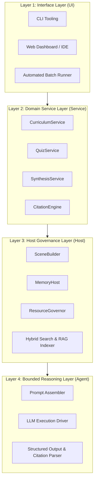
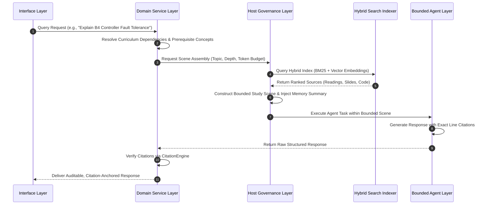
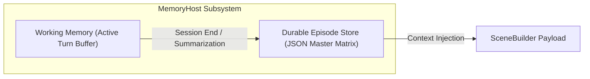

# Autonomous Research & Curriculum Agent: System Architecture and Technical Specification

## 1. System Overview and Engineering Philosophy

This specification defines the architectural design, subsystem boundaries, and data contracts for an autonomous Research and Curriculum Agent system engineered to ingest, index, synthesize, and evaluate computer networking and distributed systems courseware located within the `research/` directory tree.

### 1.1 Core Engineering Principles

1. **Host-Constrained Execution Governance:** The execution runtime (the Host) strictly governs all resource lifecycles, memory boundaries, context assembly, and file system I/O. The Large Language Model (LLM) operates strictly within bounded context windows prepared by the Host.
2. **Decoupled Four-Layer Architecture:** Complete separation of concerns between Interface (UI), Domain Logic (Service), State & Lifecycle Management (Host), and LLM Interactions (Agent).
3. **Deterministic Scene Assembly:** Rather than performing unconstrained vector searches across thousands of documents, the Host assembles a deterministic, high-density context bundle ("Study Scene") prior to invoking the LLM.
4. **Auditable Citation Anchoring:** Every analytical statement, protocol explanation, and code reference produced by the system must be contractually tied to verified line ranges within repository source files (`.md` sidecars, source code, and configuration manifests).

---

## 2. Four-Layer System Architecture



### 2.1 Layer 1: Interface Layer (UI)

The Interface Layer acts as the entry point for human interaction and automated task scheduling:

- **CLI Tooling:** Command-line interfaces for topic-driven exploration, self-assessment, and diagnostic execution.
- **Web Dashboard / IDE:** Interactive graphical interface providing real-time Markdown rendering, visual concept graphs, and document viewers.
- **Automated Batch Runner:** Asynchronous job scheduler for running large-scale repository processing, such as generating course-wide summary banks or batch quiz suites.

### 2.2 Layer 2: Domain Service Layer (Service)

The Service Layer implements domain-specific logic tailored to academic curriculum analysis:

- **`CurriculumService`:** Manages prerequisite dependency graphs across course modules (`cs231`, `cs232`, `cs233`, `cs234`), enforcing structured learning progressions.
- **`QuizService`:** Synthesizes practice problems, problem set solutions, and grading rubrics from historical homeworks, quizzes, and exams.
- **`SynthesisService`:** Conducts cross-course comparative analyses (e.g., mapping Paxos consensus mechanisms in distributed systems to centralized Software-Defined Network controllers).
- **`CitationEngine`:** Validates post-generation output to guarantee that all line references and file URIs match actual repository content.

### 2.3 Layer 3: Host Governance Layer (Host)

The Host Layer serves as the deterministic runtime engine, controlling resource boundaries, memory, and information retrieval:

- **`SceneBuilder`:** Assembles bounded, multi-source context payloads ("Study Scenes") containing relevant textbook sections, lecture slides, research papers, and source code.
- **`MemoryHost`:** Manages the dual-layer memory system comprising short-term Working Memory and long-term Durable Episode Stores.
- **`ResourceGovernor`:** Enforces strict token budgets, context limits, execution timeout boundaries, and read-only file system operations.
- **`Hybrid Search & RAG Indexer`:** Maintains a unified BM25 lexical and dense vector embedding index over plain-text `.md` sidecars, P4 source code, Python scripts, and GNS3 network topology manifests.

### 2.4 Layer 4: Bounded Reasoning Layer (Agent)

The Agent Layer isolates LLM invocation and structured response parsing:

- **Prompt Assembler:** Renders system and user prompts using host-provided scene templates.
- **LLM Execution Driver:** Dispatches requests to underlying inference APIs under strict timeout and token constraints.
- **Structured Output & Citation Parser:** Extracts structured Markdown, JSON schemas, and citation links from model responses.

---

## 3. Deterministic Scene Assembly Lifecycle



### 3.1 Study Scene Composition Formula

A Study Scene $S$ is a deterministic payload constructed by the Host prior to model invocation:

$$S = \{ R_{\text{primary}}, C_{\text{prereq}}, A_{\text{code}}, M_{\text{episode}}, B_{\text{token}} \}$$

Where:

- $R_{\text{primary}}$: Target primary reading source (e.g., paper markdown sidecar).
- $C_{\text{prereq}}$: Contextual prerequisite material (e.g., lecture slide markdown).
- $A_{\text{code}}$: Associated lab source code or network topology specification (`.p4`, `.py`, `.gns3`).
- $M_{\text{episode}}$: Condensed durable memory of student progress and previous misconceptions.
- $B_{\text{token}}$: Maximum allowable context window budget (e.g., 16,384 tokens).

---

## 4. Memory Architecture and State Management



### 4.1 Memory Classification

1. **Working Memory:** Maintains recent conversational turns and scratchpad reasoning steps during an active learning session. Working memory is discarded or summarized upon session termination.
2. **Durable Episode Store:** Maintains a persistent JSON database tracking concept mastery across sessions.

### 4.2 Durable Mastery Matrix Schema

The Durable Episode Store maintains student knowledge state structured as follows:

```json
{
  "student_id": "default_user",
  "last_updated": "2026-08-02T02:00:00Z",
  "modules": {
    "cs231-distributed-systems": {
      "paxos_consensus": { "mastery_score": 0.85, "last_reviewed": "2026-08-01" },
      "vector_clocks": { "mastery_score": 1.0, "last_reviewed": "2026-07-30" }
    },
    "cs234-advanced-networks": {
      "b4_traffic_engineering": { "mastery_score": 0.9, "last_reviewed": "2026-08-02" },
      "p4_data_plane": { "mastery_score": 0.95, "last_reviewed": "2026-08-01" }
    }
  }
}
```

---

## 5. Citation Contract and Line-Anchored Verification

### 5.1 Citation Format Standard

All agent output referencing source materials must adhere to the explicit file URI format with line ranges:

```markdown
[<relative_path>#L<start_line>-L<end_line>](file://<absolute_path>#L<start_line>-L<end_line>)
```

Example:

```markdown
[cs234-04/part-01.md#L45-L60](file:///Users/lz/dev/networking/research/cs234-advanced-networks/01-slides/cs234-04/part-01.md#L45-L60)
```

### 5.2 Citation Validation Pipeline

Before returning output to Layer 1, the `CitationEngine` verifies:

1. Target file existence on the file system.
2. Line range validity (ensuring start and end line bounds fall within actual file line counts).
3. Text content alignment (verifying that quoted text matches source line contents).

If validation fails, the response is rejected and returned to Layer 3 for re-parsing or correction.

---

## 6. Quality Assurance and CI Integration

The system architecture integrates directly into existing repository quality gates:

1. **Pre-commit Gating (`make precommit`):** Ensures that all added scripts, configuration files, and documentation pass formatting (Prettier), linting (ESLint, Flake8), and type checking (`make type`).
2. **Deterministic Test Suites:** Unit tests in `__tests__/` validate `SceneBuilder` context construction, `CitationEngine` URL verification, and `MemoryHost` serialization.
