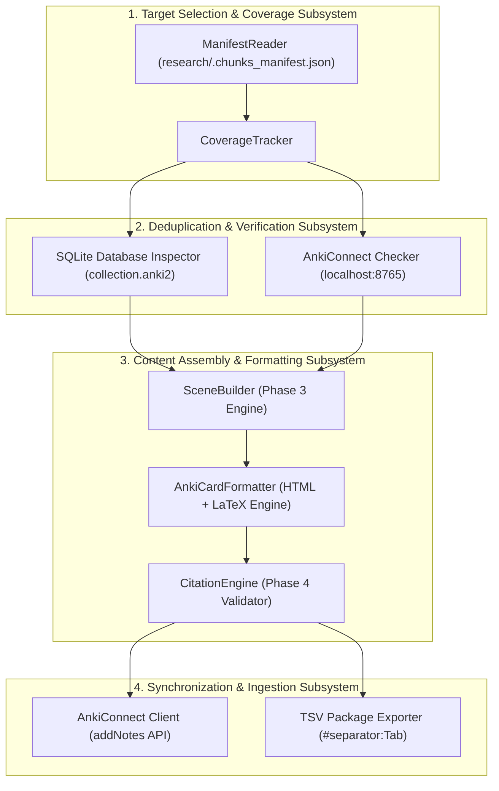
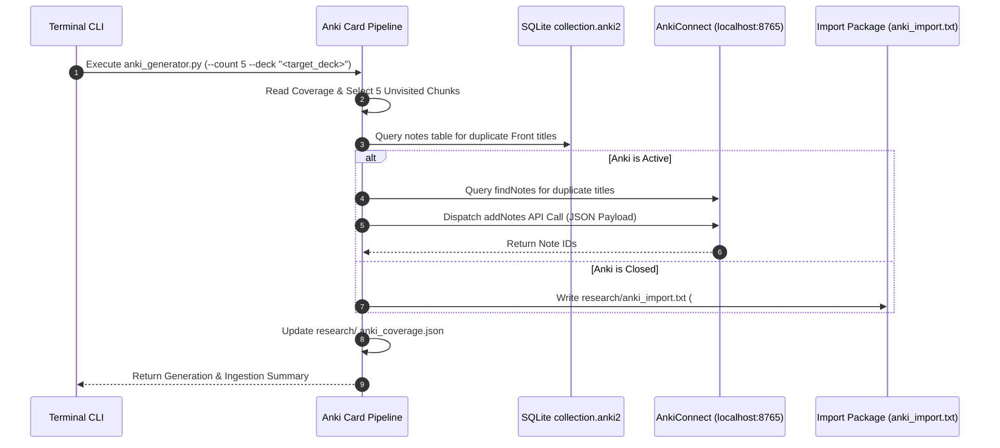
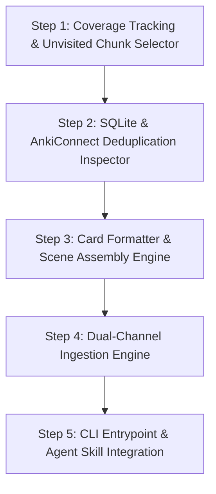

# Autonomous Anki Flashcard Generation and Synchronization Pipeline: System Specification

## 1. Overview and Core Architectural Objectives

This specification defines the system architecture, component contracts, deduplication rules, and multi-channel synchronization mechanics for an automated Anki flashcard generation pipeline. The pipeline leverages the Phase 1–5 Research Agent infrastructure (`tools/research/`) to systematically convert technical courseware in `research/` (`cs231`, `cs232`, `cs233`, `cs234`) into high-density Anki notes styled specifically for the configured target deck.

### 1.1 Core Engineering Objectives

1. **Deterministic Coverage Tracking:** Maintain an unvisited file index (`research/.anki_coverage.json`) ensuring that courseware files already processed into flashcards are marked as memorized and never revisited.
2. **Multi-Layered Deduplication:** Enforce zero-duplicate note generation by verifying note titles against live SQLite database snapshots (`collection.anki2`) and active AnkiConnect endpoints.
3. **Template Fidelity:** Generate note fields matching the user's exact note style: concise concept titles on the Front (Field 0) and structured HTML with bolded keywords, bullet points (`<ul><li><div>`), and LaTeX math notation (`\(...\)`) on the Back (Field 1).
4. **Multi-Channel Terminal Import:** Support automated terminal-based card ingestion via both the AnkiConnect HTTP REST API (`http://127.0.0.1:8765`) and fallback tab-separated TSV import packages (`#separator:Tab`, `#html:true`).

---

## 2. System Architecture and Component Model



### 2.1 Layer 1: Target Selection & Coverage Subsystem

- **`CoverageTracker`:** Tracks processed courseware files in `research/.anki_coverage.json`. Identifies unvisited, high-density chunks from Phase 1 (`research/.chunks_manifest.json`).
- **`ManifestReader`:** Loads chunk metadata, token estimates, and structural headings across `cs231`, `cs232`, `cs233`, and `cs234`.

### 2.2 Layer 2: Deduplication & Verification Subsystem

- **`SQLiteInspector`:** Connects to temporary copies of the user's live Anki database (`collection.anki2` at `~/Library/Application Support/Anki2/*/collection.anki2`) to verify that candidate note titles do not exist in table `notes`.
- **`AnkiConnectChecker`:** If Anki is running, executes `findNotes` queries against `http://127.0.0.1:8765` to confirm zero title or semantic overlap within the configured target deck.

### 2.3 Layer 3: Content Assembly & Formatting Subsystem

- **`SceneBuilderEngine`:** Invokes Phase 3 `SceneBuilder` to compile token-bounded context payloads with line-anchored citations for selected topics.
- **`CardFormatter`:** Transforms raw technical context into styled Front (Field 0) and Back (Field 1) HTML strings adhering to the target note model.
- **`CitationVerifier`:** Runs Phase 4 `CitationEngine` to confirm all embedded source file URIs match actual repository line ranges.

### 2.4 Layer 4: Synchronization & Ingestion Subsystem

- **`AnkiConnectClient`:** Dispatches structured JSON payloads to `http://127.0.0.1:8765` via action `addNotes` when Anki is active.
- **`TSVExporter`:** Generates formatted package files (`research/anki_import.txt`) with `#separator:Tab` and `#html:true` headers for terminal CLI or GUI file import when Anki is closed.

---

## 3. Ingestion Channels and Synchronization Mechanics



### 3.1 Channel A: AnkiConnect REST API Protocol

When Anki is running, the pipeline communicates directly with the AnkiConnect add-on over HTTP (`http://127.0.0.1:8765`):

```json
{
  "action": "addNotes",
  "version": 6,
  "params": {
    "notes": [
      {
        "deckName": "Target_Deck_Name",
        "modelName": "Basic",
        "fields": {
          "Front": "<strong>Security Association (SA)</strong>",
          "Back": "<div>A Security Association (SA) is a one-way, cryptographically protected connection...</div>"
        },
        "tags": ["research", "networking", "cs234"]
      }
    ]
  }
}
```

### 3.2 Channel B: Tab-Separated TSV Package Protocol

When Anki is inactive or for manual/batch import, the pipeline emits a TSV import package at `research/anki_import.txt`:

```text
#separator:Tab
#html:true
#tags:research networking cs234
Front HTML Content	Back HTML Content
```

### 3.3 Channel C: Safe SQLite Database Inspection

To prevent data corruption, direct write operations to `collection.anki2` are prohibited. Read operations copy `collection.anki2` to a temporary directory before executing SQL queries:

```sql
SELECT n.id, n.flds
FROM cards c
JOIN notes n ON c.nid = n.id
WHERE c.did = ? AND n.flds LIKE ?;
```

---

## 4. Note Template and HTML Formatting Standard

Generated notes must conform to the structural format discovered in target decks:

### 4.1 Primary Language & Terminology Translation Contract

- **Primary Language:** Card text MUST be written primarily in Chinese (Simplified Chinese).
- **Bilingual Technical Terminology:** All technical terms, protocol names, hardware modules, and domain concepts MUST include their original English names or acronyms alongside the Chinese term.
- **Example:** `网络地址转换 (Network Address Translation, NAT)`, `弹性计算服务 (Elastic Compute Service, ECS)`, `共识协议 (Consensus Protocol)`.

### 4.2 Front Field (Field 0) Standard

- Concise concept title, mechanism name, or architectural tradeoff in Chinese with English term annotations.
- Inline bolding (`<strong>`) or LaTeX math notation (`\(...\)`).
- Example: `<strong>ArBGP 遥测 (Telemetry) 的实时性</strong> —— AI 运维的眼睛`

### 4.3 Back Field (Field 1) Standard

- Clean, non-nested HTML structure using `<div>`, `<ul>`, `<li>`, `<strong>`, `<b>`, `<blockquote>`.
- Mathematical expressions formatted using LaTeX delimiters: `\( ... \)` for inline math, `\[ ... \]` for display math.
- Structured technical breakdown written in Chinese with English terminology:
  - **Motivation & Pain Point (背景 / 痛点)**
  - **Core Mechanism & Execution Flow (核心机制 & 流程)**
  - **Architectural Tradeoff & Citation (架构对比 & 源码引用)**

---

## 5. File System and Memory Artifacts

| Artifact Path                                     | Description                                     | Version Control Status  |
| :------------------------------------------------ | :---------------------------------------------- | :---------------------- |
| `tools/research/anki_generator.py`                | Core flashcard generation and ingestion script  | Tracked in Git          |
| `tools/research/__tests__/test_anki_generator.py` | Pytest unit test suite                          | Tracked in Git          |
| `research/.anki_coverage.json`                    | Persistent record of processed files and chunks | Ignored in `.gitignore` |
| `research/anki_import.txt`                        | Generated TSV flashcard import package          | Ignored in `.gitignore` |

---

## 6. Verification and Quality Gates

1. **Pre-commit Integration (`make precommit`):** `test_anki_generator.py` verifies coverage tracking, SQLite inspection, card formatting, and AnkiConnect JSON payload construction.
2. **Citation Verification:** All line references embedded in card Back fields are validated via `CitationEngine` prior to package export.

---

## 7. Systematic Implementation Roadmap and Phased Rollout



### 7.1 Phase 1: Coverage Tracking and Unvisited Chunk Selector

- **Objective:** Track processed files/chunks and select unvisited candidates from `research/.chunks_manifest.json`.
- **Deliverables:**
  - `CoverageTracker` module reading and persisting `research/.anki_coverage.json`.
  - Chunk selector filtering out previously memorized files and returning top candidate chunks.

### 7.2 Phase 2: SQLite and AnkiConnect Deduplication Inspector

- **Objective:** Guarantee zero duplicate note creation in the target Anki deck.
- **Deliverables:**
  - `SQLiteInspector` performing non-locking SQLite queries on temporary copies of `collection.anki2`.
  - `AnkiConnectChecker` querying `findNotes` over HTTP (`http://127.0.0.1:8765`) when Anki is active.
  - Candidate filter rejecting concepts already present in the target deck.

### 7.3 Phase 3: Card Formatter and Scene Assembly Engine

- **Objective:** Render high-density Anki cards conforming to target HTML and LaTeX standards.
- **Deliverables:**
  - `SceneBuilder` integration assembling token-bounded context payloads for chosen topics.
  - `CardFormatter` converting raw technical context into styled Front (`Field 0`) and Back (`Field 1`) HTML (`<ul><li><div>`, `<strong>`, `\(...\)`).
  - `CitationEngine` integration verifying line-anchored Markdown links embedded in Back fields.

### 7.4 Phase 4: Dual-Channel Ingestion Engine

- **Objective:** Provide automated note ingestion whether Anki is active or closed.
- **Deliverables:**
  - `AnkiConnectClient` sending `addNotes` JSON requests to `http://127.0.0.1:8765`.
  - `TSVExporter` writing UTF-8 tab-separated package files (`research/anki_import.txt`) with `#separator:Tab` and `#html:true` headers.

### 7.5 Phase 5: CLI Entrypoint and Agent Skill Integration

- **Objective:** Expose unified command interface and agent skill.
- **Deliverables:**
  - CLI executable `python3 tools/research/anki_generator.py --count 5 --deck "<target_deck>"`.
  - Updated agent skill `.agents/skills/research-agent/SKILL.md` and synchronized command `.claude/commands/research-agent.md`.
