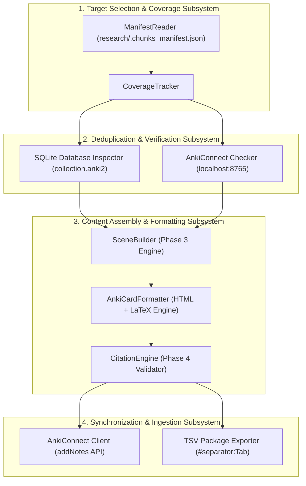
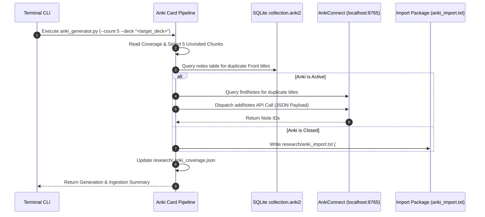
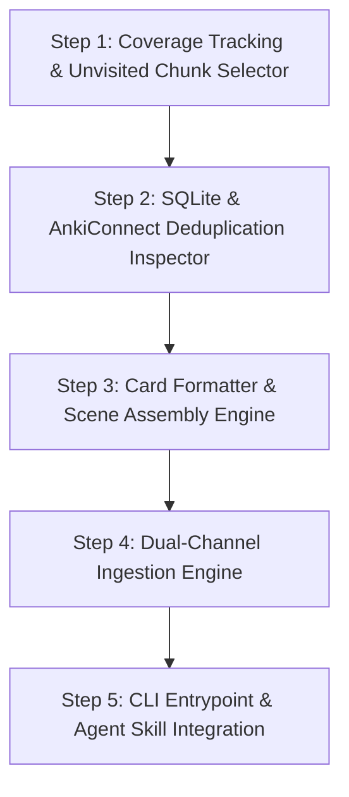
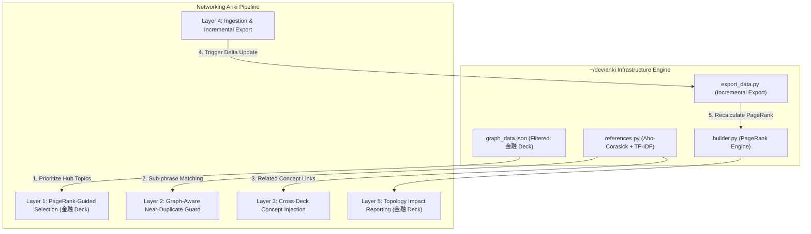

# Autonomous Anki Flashcard Generation and Synchronization Pipeline: System Specification

## 1. Overview and Core Architectural Objectives

This specification defines the system architecture, component contracts, deduplication rules, and multi-channel synchronization mechanics for an automated Anki flashcard generation pipeline. The pipeline leverages the Phase 1–5 Research Agent infrastructure (`tools/research/`) to systematically convert technical courseware in `research/` (`cs231`, `cs232`, `cs233`, `cs234`) into high-density Anki notes styled specifically for the configured target deck.

### 1.1 Core Engineering Objectives

1. **Deterministic Coverage Tracking:** Maintain an unvisited file index (`research/.anki_coverage.json`) ensuring that courseware files already processed into flashcards are marked as memorized and never revisited.
2. **Multi-Layered Deduplication:** Enforce zero-duplicate note generation by verifying note titles against live SQLite database snapshots (`collection.anki2`) and active AnkiConnect endpoints.
3. **Template Fidelity:** Generate note fields matching the user's exact note style: concise concept titles on the Front (Field 0) and structured HTML with bolded keywords, bullet points (`<ul><li><div>`), and LaTeX math notation (`\(...\)`) on the Back (Field 1).
4. **Multi-Channel Terminal Import:** Support automated terminal-based card ingestion via both the AnkiConnect HTTP REST API (`http://127.0.0.1:8765`) and fallback tab-separated TSV import packages (`#separator:Tab`, `#html:true`).

---

## 2. System Architecture and Component Model



### 2.1 Layer 1: Target Selection & Coverage Subsystem

- **`CoverageTracker`:** Tracks processed courseware files in `research/.anki_coverage.json`. Identifies unvisited, high-density chunks from Phase 1 (`research/.chunks_manifest.json`).
- **`ManifestReader`:** Loads chunk metadata, token estimates, and structural headings across `cs231`, `cs232`, `cs233`, and `cs234`.

### 2.2 Layer 2: Deduplication & Verification Subsystem

- **`SQLiteInspector`:** Connects to temporary copies of the user's live Anki database (`collection.anki2` at `~/Library/Application Support/Anki2/*/collection.anki2`) to verify that candidate note titles do not exist in table `notes`.
- **`AnkiConnectChecker`:** If Anki is running, executes `findNotes` queries against `http://127.0.0.1:8765` to confirm zero title or semantic overlap within the configured target deck.

### 2.3 Layer 3: Content Assembly & Formatting Subsystem

- **`SceneBuilderEngine`:** Invokes Phase 3 `SceneBuilder` to compile token-bounded context payloads with line-anchored citations for selected topics.
- **`CardFormatter`:** Transforms raw technical context into styled Front (Field 0) and Back (Field 1) HTML strings adhering to the target note model.
- **`CitationVerifier`:** Runs Phase 4 `CitationEngine` to confirm all embedded source file URIs match actual repository line ranges.

### 2.4 Layer 4: Synchronization & Ingestion Subsystem

- **`AnkiConnectClient`:** Dispatches structured JSON payloads to `http://127.0.0.1:8765` via action `addNotes` when Anki is active.
- **`TSVExporter`:** Generates formatted package files (`research/anki_import.txt`) with `#separator:Tab` and `#html:true` headers for terminal CLI or GUI file import when Anki is closed.

---

## 3. Ingestion Channels and Synchronization Mechanics



### 3.1 Channel A: AnkiConnect REST API Protocol

When Anki is running, the pipeline communicates directly with the AnkiConnect add-on over HTTP (`http://127.0.0.1:8765`):

```json
{
  "action": "addNotes",
  "version": 6,
  "params": {
    "notes": [
      {
        "deckName": "Target_Deck_Name",
        "modelName": "Basic",
        "fields": {
          "Front": "<strong>Security Association (SA)</strong>",
          "Back": "<div>A Security Association (SA) is a one-way, cryptographically protected connection...</div>"
        },
        "tags": ["research", "networking", "cs234"]
      }
    ]
  }
}
```

### 3.2 Channel B: Tab-Separated TSV Package Protocol

When Anki is inactive or for manual/batch import, the pipeline emits a TSV import package at `research/anki_import.txt`:

```text
#separator:Tab
#html:true
#tags:research networking cs234
Front HTML Content	Back HTML Content
```

### 3.3 Channel C: Safe SQLite Database Inspection

To prevent data corruption, direct write operations to `collection.anki2` are prohibited. Read operations copy `collection.anki2` to a temporary directory before executing SQL queries:

```sql
SELECT n.id, n.flds
FROM cards c
JOIN notes n ON c.nid = n.id
WHERE c.did = ? AND n.flds LIKE ?;
```

---

## 4. Note Template and HTML Formatting Standard

Generated notes must conform to the structural format discovered in target decks:

### 4.1 Primary Language & Terminology Translation Contract

- **Primary Language:** Card text MUST be written primarily in Chinese (Simplified Chinese).
- **Bilingual Technical Terminology:** All technical terms, protocol names, hardware modules, and domain concepts MUST include their original English names or acronyms alongside the Chinese term.
- **Example:** `网络地址转换 (Network Address Translation, NAT)`, `弹性计算服务 (Elastic Compute Service, ECS)`, `共识协议 (Consensus Protocol)`.

### 4.2 Front Field (Field 0) Standard

- Concise concept title, mechanism name, or architectural tradeoff in Chinese with English term annotations.
- Inline bolding (`<strong>`) or LaTeX math notation (`\(...\)`).
- Example: `<strong>ArBGP 遥测 (Telemetry) 的实时性</strong> —— AI 运维的眼睛`

### 4.3 Back Field (Field 1) Standard

- Clean, non-nested HTML structure using `<div>`, `<ul>`, `<li>`, `<strong>`, `<b>`, `<blockquote>`.
- Mathematical expressions formatted using LaTeX delimiters: `\( ... \)` for inline math, `\[ ... \]` for display math.
- Structured technical breakdown written in Chinese with English terminology:
  - **Motivation & Pain Point (背景 / 痛点)**
  - **Core Mechanism & Execution Flow (核心机制 & 流程)**
  - **Architectural Tradeoff & Citation (架构对比 & 源码引用)**

---

## 5. File System and Memory Artifacts

| Artifact Path                                     | Description                                     | Version Control Status  |
| :------------------------------------------------ | :---------------------------------------------- | :---------------------- |
| `tools/research/anki_generator.py`                | Core flashcard generation and ingestion script  | Tracked in Git          |
| `tools/research/__tests__/test_anki_generator.py` | Pytest unit test suite                          | Tracked in Git          |
| `research/.anki_coverage.json`                    | Persistent record of processed files and chunks | Ignored in `.gitignore` |
| `research/anki_import.txt`                        | Generated TSV flashcard import package          | Ignored in `.gitignore` |

---

## 6. Verification and Quality Gates

1. **Pre-commit Integration (`make precommit`):** `test_anki_generator.py` verifies coverage tracking, SQLite inspection, card formatting, and AnkiConnect JSON payload construction.
2. **Citation Verification:** All line references embedded in card Back fields are validated via `CitationEngine` prior to package export.

---

## 7. Systematic Implementation Roadmap and Phased Rollout



### 7.1 Phase 1: Coverage Tracking and Unvisited Chunk Selector

- **Objective:** Track processed files/chunks and select unvisited candidates from `research/.chunks_manifest.json`.
- **Deliverables:**
  - `CoverageTracker` module reading and persisting `research/.anki_coverage.json`.
  - Chunk selector filtering out previously memorized files and returning top candidate chunks.

### 7.2 Phase 2: SQLite and AnkiConnect Deduplication Inspector

- **Objective:** Guarantee zero duplicate note creation in the target Anki deck.
- **Deliverables:**
  - `SQLiteInspector` performing non-locking SQLite queries on temporary copies of `collection.anki2`.
  - `AnkiConnectChecker` querying `findNotes` over HTTP (`http://127.0.0.1:8765`) when Anki is active.
  - Candidate filter rejecting concepts already present in the target deck.

### 7.3 Phase 3: Card Formatter and Scene Assembly Engine

- **Objective:** Render high-density Anki cards conforming to target HTML and LaTeX standards.
- **Deliverables:**
  - `SceneBuilder` integration assembling token-bounded context payloads for chosen topics.
  - `CardFormatter` converting raw technical context into styled Front (`Field 0`) and Back (`Field 1`) HTML (`<ul><li><div>`, `<strong>`, `\(...\)`).
  - `CitationEngine` integration verifying line-anchored Markdown links embedded in Back fields.

### 7.4 Phase 4: Dual-Channel Ingestion Engine

- **Objective:** Provide automated note ingestion whether Anki is active or closed.
- **Deliverables:**
  - `AnkiConnectClient` sending `addNotes` JSON requests to `http://127.0.0.1:8765`.
  - `TSVExporter` writing UTF-8 tab-separated package files (`research/anki_import.txt`) with `#separator:Tab` and `#html:true` headers.

### 7.5 Phase 5: CLI Entrypoint and Agent Skill Integration

- **Objective:** Expose unified command interface and agent skill.
- **Deliverables:**
  - CLI executable `python3 tools/research/anki_generator.py --count 5 --deck "<target_deck>"`.
  - Updated agent skill `.agents/skills/research-agent/SKILL.md` and synchronized command `.claude/commands/research-agent.md`.

---

## 8. Integration with `~/dev/anki` PageRank & Knowledge Graph Infrastructure

This section specifies how the card generation pipeline leverages the pre-existing PageRank knowledge graph engine and local graph datasets stored in `~/dev/anki/`.

> [!IMPORTANT]
> **Strict Deck Scope Isolation (`金融` Deck Focus):**
> `graph_data.json` contains over 160,000 notes across multiple decks. All language-learning decks (`言語日語`, `言語粤語`, `言語英語`, `言語呉語`, `言語台語`) are completely irrelevant to networking and computer systems engineering. The pipeline MUST strictly filter nodes and edges to focus **exclusively on the `金融` deck**, which hosts technical, financial, and domain infrastructure cards.

### 8.1 Overview of `~/dev/anki` Graph Datasets and Engines

| Component / File Path | Location / Size                                 | Purpose & Technical Capability                                                                                                                                          |
| :-------------------- | :---------------------------------------------- | :---------------------------------------------------------------------------------------------------------------------------------------------------------------------- |
| `graph_data.json`     | `~/dev/anki/graph/graph_data.json` (~159 MB)    | Full local knowledge graph containing note GUIDs, Front labels, deck attributes, calculated PageRank scores, 3D coordinates ($x, y, z$), and directed edge links.       |
| `history_data.json`   | `~/dev/anki/graph/history_data.json` (~15.8 MB) | Historical card review trajectory data mapped by review date.                                                                                                           |
| `builder.py`          | `~/dev/anki/graph/builder.py`                   | Constructs NetworkX directed graphs (`nx.DiGraph`) and computes PageRank scores ($\alpha = 0.85$).                                                                      |
| `references.py`       | `~/dev/anki/graph/references.py`                | Executes $O(N + M)$ multi-pattern substring matching via Aho-Corasick automatons with TF-IDF / Max-DF gating ($\le 2\%$ document frequency) and weighted edge creation. |
| `export_data.py`      | `~/dev/anki/graph/export_data.py`               | Performs ForceAtlas2 and 3D Fibonacci sphere layout generation; supports fast incremental updates via `.export_cache.json`.                                             |
| `pagerank_report.py`  | `~/dev/anki/graph/pagerank_report.py`           | Provides concept normalization (`_normalize_concept`) and generates Markdown reports ranking hub nodes and isolated cards.                                              |

### 8.2 Architectural Integration Vectors



1. **PageRank-Guided Candidate Selection (Phase 1):**
   - _Mechanic:_ Rather than selecting unvisited courseware chunks sequentially, `CoverageTracker` cross-references candidate topics against high-PageRank hub nodes in `graph_data.json` belonging strictly to the `金融` deck.
   - _Impact:_ Guarantees that foundational topics strongly linked to existing technical card clusters are generated and memorized first.

2. **Graph-Aware Near-Duplicate Guard (Phase 2):**
   - _Mechanic:_ Employs `_normalize_concept()` and TF-IDF sub-phrase filtering from `references.py` to check whether a candidate concept is already covered within compound cards in the `金融` deck.
   - _Impact:_ Rejects semantic near-duplicates that pass standard exact-title string matching.

3. **Concept Linking & Related Card Injection (Phase 3):**
   - _Mechanic:_ Passes candidate card Back text through an Aho-Corasick automaton built from `金融` deck nodes in `graph_data.json`. High-PageRank matching concept labels are appended under a structured HTML section (`<div class="related-concepts">...</div>`).
   - _Impact:_ Automatically contextualizes new networking notes within the user's broader `金融` knowledge graph.

4. **Automated Post-Ingestion Incremental Graph Update (Phase 4):**
   - _Mechanic:_ Upon successful note ingestion via AnkiConnect, the pipeline triggers `python3 ~/dev/anki/graph/export_data.py` to perform an incremental delta update using `.export_cache.json`.
   - _Impact:_ Keeps the 3D visualization and local graph datasets synchronized without costly full 160k-node graph rebuilds.

5. **PageRank Topology Impact Reporting (Phase 5):**
   - _Mechanic:_ Invokes `pagerank_report.py` to measure the network effect of newly added notes in `金融`, outputting metrics on whether new cards formed new hubs or resolved isolated nodes.

### 8.3 Interface Contract & Bridge Module (`AnkiGraphBridge`)

To maintain subproject isolation and prevent code duplication, integration is mediated by a dedicated bridge module (`tools/research/anki_graph_bridge.py`), configured to filter specifically for the target deck (`金融`):

```python
"""Anki Knowledge Graph Bridge (tools/research/anki_graph_bridge.py).

Interfaces with ~/dev/anki/graph to provide PageRank lookup, Aho-Corasick subphrase matching,
and automated graph re-export triggers scoped strictly to the target deck (金融).
"""

from __future__ import annotations

import json
import sys
from pathlib import Path
from typing import Any

ANKI_REPO_ROOT = Path("/Users/lz/dev/anki")
if str(ANKI_REPO_ROOT) not in sys.path:
    sys.path.insert(0, str(ANKI_REPO_ROOT))

class AnkiGraphBridge:
    """Bridge for querying ~/dev/anki graph data scoped strictly to target deck (金融)."""

    def __init__(self, target_deck: str = "金融", repo_root: Path = ANKI_REPO_ROOT):
        self.target_deck = target_deck
        self.repo_root = repo_root
        self.graph_path = repo_root / "graph" / "graph_data.json"
        self.nodes: list[dict[str, Any]] = []
        self.links: list[dict[str, Any]] = []
        self._load_graph_data()

    def _load_graph_data(self) -> None:
        """Loads and filters nodes and links strictly for the target deck (金融)."""
        if not self.graph_path.exists():
            return
        try:
            data = json.loads(self.graph_path.read_text(encoding="utf-8"))
            raw_nodes = data.get("nodes", [])
            raw_links = data.get("links", [])

            # Filter nodes strictly for the target deck (ignoring language decks)
            filtered_node_ids = set()
            for node in raw_nodes:
                deck_name = node.get("deck") or node.get("d") or ""
                if deck_name == self.target_deck:
                    self.nodes.append(node)
                    filtered_node_ids.add(node.get("id"))

            # Filter links where both source and target belong to target_deck
            for link in raw_links:
                src = link.get("source") or link.get("s")
                tgt = link.get("target") or link.get("t")
                if src in filtered_node_ids and tgt in filtered_node_ids:
                    self.links.append(link)
        except Exception:
            pass

    def get_related_hubs(self, text: str, top_n: int = 3) -> list[tuple[str, float, str]]:
        """Scans input text for concept labels present in the target deck's knowledge graph, returning top-N by PageRank."""
        from graph.references import _normalize

        norm_text = _normalize(text)
        matches = []
        for node in self.nodes:
            label = node.get("label") or node.get("l") or ""
            if label and len(label) >= 2 and _normalize(label) in norm_text:
                pr = float(node.get("pagerank") or node.get("p") or 0.0)
                matches.append((label, pr, self.target_deck))
        matches.sort(key=lambda x: x[1], reverse=True)
        return matches[:top_n]
```

---

## 9. Hierarchical Multi-Level Coverage Progress Bar Subsystem

This section specifies the progress tracking and visual terminal reporting subsystem that quantifies courseware memorization coverage across three distinct levels of directory hierarchy after flashcard batch generation.

### 9.1 Core Coverage Objectives & Granularity Levels

After executing card generation and ingestion, the pipeline computes and renders a multi-level coverage progress report to inform the user of exact memorization progress:

1. **Submodule Level Coverage (Level A):** Percentage of chunks memorized within the specific active submodule or folder (e.g., `research/cs231-distributed-systems/00-materials`).
2. **Course Level Coverage (Level B):** Aggregate percentage of chunks memorized across the entire course directory (e.g., `research/cs231-distributed-systems`).
3. **Global Repository Level Coverage (Level C):** Overall percentage of chunks memorized across all courseware in `research/` (`cs231`, `cs232`, `cs233`, `cs234`).

### 9.2 Progress Bar Terminal UI Standard

Upon completing card generation, or when calling `python3 tools/research/anki_generator.py --status`, the terminal outputs the following standardized progress report:

```text
================================================================================
📊 Anki Courseware Memorization Progress Report
================================================================================
  Submodule : cs231-distributed-systems/00-materials
              [██████████████████████░░░░░░░░░░░░░░░░░░░░]  52.4% (22/42 chunks)

  Course    : cs231-distributed-systems
              [████████████████░░░░░░░░░░░░░░░░░░░░░░░░░░]  38.1% (120/315 chunks)

  Global    : research/ (cs231, cs232, cs233, cs234)
              [████████░░░░░░░░░░░░░░░░░░░░░░░░░░░░░░░░░░]  18.5% (450/2430 chunks)
================================================================================
```

### 9.3 Calculation Formula and Data Sources

- **Manifest Source (`research/.chunks_manifest.json`):** Supplies total chunk count ($T_{scope}$) for each scope prefix.
- **Coverage Source (`research/.anki_coverage.json`):** Supplies visited chunk IDs ($V_{scope}$) marked as processed into Anki notes.
- **Formula:**
  $$\text{Coverage \%} = \left( \frac{|V_{scope}|}{|T_{scope}|} \right) \times 100\%$$

| Scope Level             | Prefix Extraction Logic                                            | Total Chunks ($T$) Definition                                    | Visited Chunks ($V$) Definition                                   |
| :---------------------- | :----------------------------------------------------------------- | :--------------------------------------------------------------- | :---------------------------------------------------------------- |
| **Submodule (Level A)** | Parent directory of generated chunks (`research/course/submodule`) | Chunks in manifest where `file_path` starts with `submodule_dir` | Chunks in `visited_chunk_ids` with matching `submodule_dir`       |
| **Course (Level B)**    | Second directory segment (`research/course`)                       | Chunks in manifest where `file_path` starts with `course_dir`    | Chunks in `visited_chunk_ids` with matching `course_dir`          |
| **Global (Level C)**    | `research/` root prefix                                            | All valid chunks in `research/.chunks_manifest.json`             | All entries in `research/.anki_coverage.json` `visited_chunk_ids` |

### 9.4 Implementation Blueprint (`CoverageTracker` Extensions)

The `CoverageTracker` class in `tools/research/anki_generator.py` is extended with multi-level aggregation and bar rendering methods:

```python
class CoverageProgressReporter:
    """Computes and renders multi-level coverage progress bars."""

    @staticmethod
    def render_bar(visited: int, total: int, width: int = 40) -> str:
        """Renders an ASCII block progress bar string."""
        pct = (visited / total * 100.0) if total > 0 else 0.0
        filled_len = int(width * visited // total) if total > 0 else 0
        bar = "█" * filled_len + "░" * (width - filled_len)
        return f"[{bar}] {pct:5.1f}% ({visited}/{total} chunks)"

    @classmethod
    def print_report(
        cls,
        manifest_chunks: list[dict[str, Any]],
        visited_chunk_ids: set[str],
        active_file_path: str | None = None,
    ) -> None:
        """Calculates and prints Submodule, Course, and Global progress bars."""
        if not manifest_chunks:
            return

        global_total = len(manifest_chunks)
        global_visited = sum(1 for c in manifest_chunks if c["chunk_id"] in visited_chunk_ids)

        course_dir = ""
        submodule_dir = ""
        if active_file_path:
            parts = Path(active_file_path).parts
            if len(parts) >= 2:
                course_dir = str(Path(*parts[:2]))
            if len(parts) >= 3:
                submodule_dir = str(Path(*parts[:3]))

        print("\n" + "=" * 80)
        print("📊 Anki Courseware Memorization Progress Report")
        print("=" * 80)

        if submodule_dir:
            sub_chunks = [c for c in manifest_chunks if c["file_path"].startswith(submodule_dir)]
            sub_vis = sum(1 for c in sub_chunks if c["chunk_id"] in visited_chunk_ids)
            sub_label = Path(submodule_dir).relative_to("research") if submodule_dir.startswith("research") else submodule_dir
            print(f"  Submodule : {sub_label}")
            print(f"              {cls.render_bar(sub_vis, len(sub_chunks))}\n")

        if course_dir:
            crs_chunks = [c for c in manifest_chunks if c["file_path"].startswith(course_dir)]
            crs_vis = sum(1 for c in crs_chunks if c["chunk_id"] in visited_chunk_ids)
            crs_label = Path(course_dir).name
            print(f"  Course    : {crs_label}")
            print(f"              {cls.render_bar(crs_vis, len(crs_chunks))}\n")

        print(f"  Global    : research/ (cs231, cs232, cs233, cs234)")
        print(f"              {cls.render_bar(global_visited, global_total)}")
        print("=" * 80 + "\n")
```
