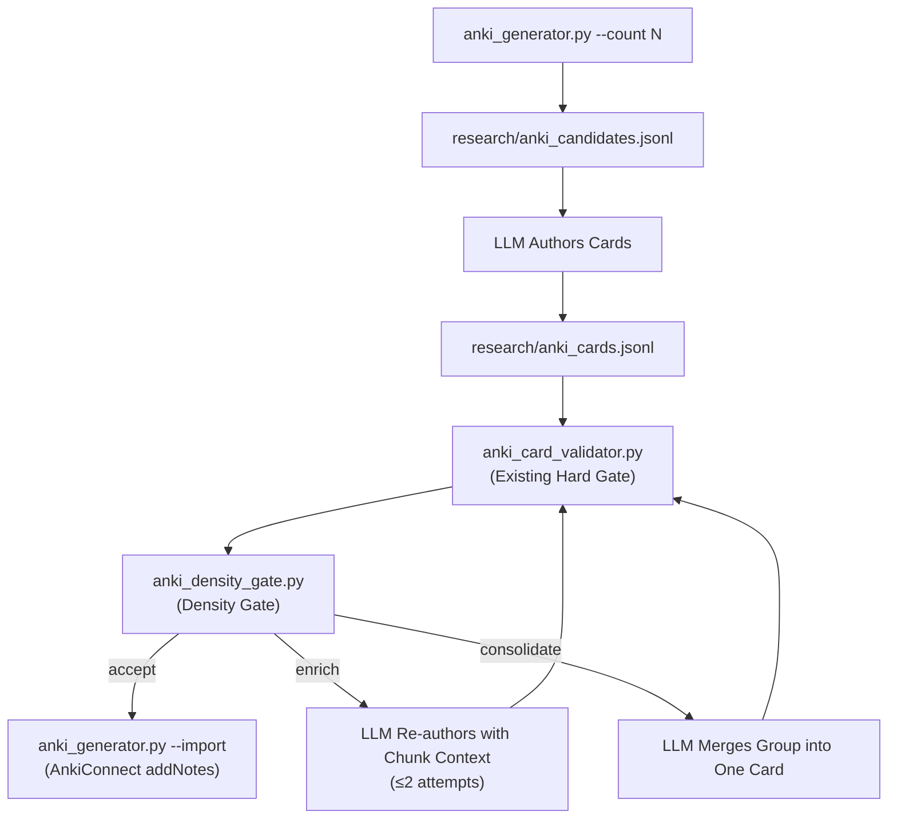
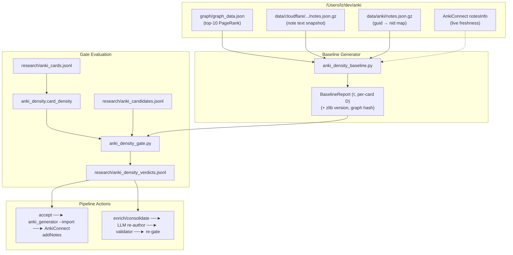

# Anki Card Information Density: Deterministic Metric and Density-Gated Generation Pipeline

Status: Implemented (Phase 0–5 complete). Deterministic metric, baseline builder, density gate, pipeline integration, and validation experiments operational.

## 1. The question

Can we compute an Anki flashcard's "information density" quantitatively and
deterministically — no LLM calls, no randomness, cheap, and comparable across
cards — and use that number to gate a card-generation pipeline: a newly
generated card whose density falls below the mean density of the top-10
highest-PageRank cards already in the 金融 deck is either enriched with more
content from its source chunk, or consolidated with sibling low-density cards
into a single denser card? All other decks — language decks — are explicitly
out of scope; the baseline is computed from 金融 alone.

## 2. The answer

### 2.1 Recommended metric: a pinned, three-component composite

Score each card on the concatenation of its Front and Back fields after a fixed
normalization pipeline, then combine three deterministic components:

$$
\begin{aligned}
x &= \text{normalize}(\text{front} + \text{" "} + \text{back}) \\
D_{\text{comp}} &= 1 - \frac{|\text{zlib}_9(\text{utf8}(x))| - |\text{zlib}_9(\text{""})|}{|\text{utf8}(x)|} \quad &&\text{(compression density)} \\
D_{\text{lex}} &= \text{MTLD}(\text{tokens}(x), \text{threshold} = 0.72, \text{bidirectional}) \quad &&\text{(lexical diversity)} \\
D_{\text{concept}} &= \frac{|\text{distinct technical tokens}|}{|\text{tokens}(x)|} \times 100 \quad &&\text{(technical-form proxy)} \\
D_{\text{domain}} &= \frac{|\text{tokens}(x) \cap L_{\text{deck}}|}{|\text{tokens}(x)|} \times 100 \quad &&\text{(domain-lexicon coverage)} \\
D(\text{card}) &= 0.4 \cdot D_{\text{comp}} + 0.2 \cdot \frac{D_{\text{lex}}}{100} + 0.2 \cdot \frac{D_{\text{concept}}}{100} + 0.2 \cdot \frac{D_{\text{domain}}}{100}
\end{aligned}
$$

Weights are engineering defaults, not literature-derived constants (see §5).

**Component 1 — compression density (`D_comp`).** Kolmogorov complexity K(x) —
the length of the shortest program producing x — is the theoretically correct
"absolute information content" of a string, but it is uncomputable; any lossless
compressor upper-bounds K up to an additive constant, which is the standard
practical workaround (Li & Vitányi's textbook; Cilibrasi & Vitányi's
"Clustering by compression", IEEE Trans. Inf. Theory 2005, which builds the
Normalized Compression Distance on exactly this idea). zlib (DEFLATE, RFC
1950/1951) is stdlib in Python, so `1 - compressed/raw` is a cheap, local,
repeatable proxy for per-byte redundancy. The `- |zlib9("")|` term removes the
fixed 8-byte zlib stream overhead, which otherwise dominates at card lengths
(measured: a 64-character note scored a raw ratio of 1.109 — compression made
it "bigger"). Compression ratio is an entropy-rate estimate, and the
entropy-rate-constancy result of Genzel & Charniak (ACL 2002) is the
theoretical hook: within a document, per-word entropy is roughly constant, so a
card that is far less compressible *or* far more compressible than its deck
peers deviates from the deck's information regime.

**Component 2 — lexical diversity (`D_lex`, MTLD).** Plain type-token ratio is
rejected: TTR degrades systematically with text length, so it cannot compare a
70-character card against a 600-character one. McCarthy & Jarvis (Behavior
Research Methods, 2010) validated MTLD — "the mean length of word strings that
maintain a criterion level of lexical variation" — as length-insensitive,
against vocd-D, HD-D, Maas and Yule's K. MTLD is chosen over the alternatives
on determinism grounds: classic vocd-D uses random sampling (non-deterministic
without seed pinning), HD-D is deterministic but hypergeometric and costlier;
MTLD is a single deterministic pass (run forward and backward, averaged, per
McCarthy's reference implementation). Caveat measured in §4: below roughly 50
tokens MTLD is coarse (a 9-token card scored 0.0), so `D_lex` must carry a
minimum-token flag and the gate should treat `tokens < 50` as "lexical
component unreliable, fall back to `D_comp` + `D_concept` only".

**Component 3 — technical-form proxy (`D_concept`).** Count of distinct
"technical" tokens — acronyms, digit-containing tokens, camelCase/mixed-case
identifiers, and CJK compound runs — per 100 tokens. This captures *formal*
markers of technicality (a card full of RFC numbers and protocol acronyms
scores high), but it cannot tell domain content from generic prose. It is a
deliberately simple, deterministic stand-in for proposition/concept count;
there is no accepted deterministic proposition-count metric for short
bilingual text (see §5).

**Component 4 — domain-lexicon coverage (`D_domain`).** Fraction of tokens
that appear in `L_deck`, a deterministic lexicon built from the top-K
highest-PageRank cards in the target deck (金融). This is the component that
distinguishes "hardcore domain content" from "easy general knowledge" when
surface length and lexical diversity are equal: a card about TCP congestion
window mechanics shares vocabulary with the deck's hub cards; a card of
generic description does not, even if both are equally long and lexically
diverse. The lexicon is built deterministically: take the top-K hub cards'
full text, tokenize, drop stopwords and single-character CJK tokens, keep the
`max_terms` most frequent tokens. Because the lexicon is derived from the
same deck the card will join, the component is self-calibrating — it measures
relevance to *this* deck's core, not to an external domain model.

**Determinism contract (the part that makes or breaks reproducibility).** All
of the following must be pinned and recorded alongside every score:

- Unicode normalization to **NFC** before anything else.
- HTML stripped and entities unescaped (cards are HTML; raw markup would
  inflate compressibility uniformly, but stripping keeps the metric about
  prose).
- Whitespace collapsed; text **lowercased** (policy applies to Latin only in
  practice; CJK unaffected).
- Tokenizer: **jieba** (pinned version) for CJK segmentation — dependency
  permitted per design decision; use `jieba.cut(text, HMM=False)` for full
  determinism (HMM-on uses a statistical model whose output can drift across
  jieba releases). Latin/digit tokens extracted with a fixed regex
  (`[a-z0-9]+`). The jieba version and its dictionary hash are recorded with
  every baseline.
- zlib: `zlib.compress(data, 9)`, and **record `zlib.ZLIB_VERSION`** with each
  baseline. RFC 1950/1951 standardize the *stream format*, not encoder output;
  encoder output is stable for a given library version and level but is not
  guaranteed across zlib releases, so baselines must be recomputed if the
  pinned version changes (measured here: identical output across runs, zlib
  1.2.12).
- Scores compared only against baselines computed with the identical pipeline.

**What this metric is NOT, on purpose:**

- *Not readability.* Flesch-style formulas (Flesch 1948) measure reading ease
  from sentence length and syllable counts — a card can be easy to read and
  dense, or hard to read and empty. Readability correlates with surface
  difficulty, not information content.
- *Not raw unigram Shannon entropy.* Shannon (1948) defines entropy over a
  symbol distribution; a per-card unigram entropy ignores sequential redundancy
  (repeated phrases, boilerplate section headers), which is exactly what
  low-density generated cards exhibit. Compression captures it; unigram entropy
  does not.
- *Not a UID conformance score.* The Uniform Information Density hypothesis
  (Levy & Jaeger, NIPS 2006/2007; Jaeger, Cognitive Psychology 2010) — that
  speakers distribute information to avoid peaks and troughs — is the
  theoretical grounding for why density is a meaningful property of a text at
  all, and UID-derived features have proven computable and discriminative in
  practice (the GPT-who detector, Venkatraman et al. 2023, uses UID-based
  features and is "computationally inexpensive"). But UID conformance requires
  a language model to compute per-token surprisal, which violates the
  no-LLM/determinism constraint; it informs the design, it is not the metric.

### 2.2 Why a composite rather than a single number

Each component has a measured failure mode at card length: compression density
is noisy below ~100 characters (fixed overhead), MTLD is coarse below ~50
tokens, and the form/domain proxies can be gamed by acronym or lexicon spam.
The composite with a majority fallback (drop `D_lex` when its token guard
trips) means no single degenerate input flips a decision. The comparison that actually matters is
relative — a card versus the top-10 hub cards of its own deck, scored with the
identical pipeline — which cancels systematic bias in each component.

### 2.3 Information-theory foundations (notation reference)

Shannon entropy of a discrete source $X$ with symbol probabilities $p(x)$:

$$
H(X) = -\sum_{x \in \mathcal{X}} p(x) \log_2 p(x)
$$

Per-card unigram entropy treats each token as an independent draw; it ignores
sequential redundancy and therefore overestimates the information of repetitive
text.

Entropy rate of a stochastic process $\{X_i\}$:

$$
H(\mathcal{X}) = \lim_{n \to \infty} \frac{1}{n} H(X_1, X_2, \dots, X_n)
$$

Genzel & Charniak's entropy-rate-constancy result says $H(\mathcal{X})$ is
roughly constant within a coherent document; large deviations signal a regime
change (e.g., a generated card sparser than its deck peers).

Kolmogorov complexity of a string $x$:

$$
K(x) = \min_{p : U(p) = x} |p|
$$

where $U$ is a universal Turing machine. $K(x)$ is uncomputable; any lossless
compressor $C$ gives an upper bound $K(x) \leq |C(x)| + O(1)$, which is why
zlib is a practical proxy.

Normalized Compression Distance (Cilibrasi & Vitányi) between strings $x$ and
$y$:

$$
NCD(x, y) = \frac{C(xy) - \min\{C(x), C(y)\}}{\max\{C(x), C(y)\}}
$$

Our per-card compression density is the one-sided analogue:

$$
D_{\text{comp}}(x) = 1 - \frac{|C(x)| - |C(\varepsilon)|}{|x|}
$$

where the empty-string term removes fixed stream overhead.

Surprisal (information content) of token $w_i$ in context:

$$
I(w_i) = -\log_2 P(w_i \mid w_1, \dots, w_{i-1})
$$

UID-style density scoring would average $I(w_i)$ over a card; it requires a
language model for $P$, so we approximate the same intuition with the
domain-lexicon and compression components instead.

## 3. Architecture design

### 3.1 Where each input comes from (verified against the code)

- **PageRank values** come from the sibling repo's export
  `/Users/lz/dev/anki/graph/graph_data.json`. Verified on disk: 164,309 nodes,
  2,188,978 links, deck `金融` has 14,679 nodes, each node carrying
  `{id (note guid), label, deck, pagerank, size, x, y, z}`. `builder.py`
  computes PageRank (`networkx.pagerank`, alpha=0.85) and attaches it per node;
  `export_data.py` writes the JSON. `tools/research/anki_graph_bridge.py`
  already loads this file and filters nodes to the target deck — the baseline
  builder should reuse it, not re-parse the file.
- **Existing cards' text.** Two constraints shape this: (a) the AGENTS.md
  safety rule — never raw SQLite reads/writes on live collections, use
  AnkiConnect REST; (b) the graph export's `label` is `strip_html()`-truncated
  to 60 characters (`export_data.py`), so density **cannot** be computed from
  the graph file alone. Two fetch paths:
  - *Live via AnkiConnect (preferred, to be validated):* map guid → note id
    via `data/anki/notes.json.gz` (verified: has `guid` and `id`, no `flds`),
    then AnkiConnect `notesInfo` for current fields. Needed because Anki's
    search syntax exposes `nid:`/`cid:` but no `guid:` query
    (docs.ankiweb.net/searching.html). This avoids the large staged R2 export
    and stays current with the collection; latency and schema correctness are
    testable assumptions (see §6 test plan).
  - *Offline (fallback):* the staged export
    `data/cloudflare/collection/notes.json.gz` in the anki repo (verified:
    164,309 notes with `guid` and full `flds`, field separator `\x1f`) is the
    same snapshot the graph was built from, so guid → full text joins cleanly
    and deterministically. It is a read-only file export, not SQLite, but the
    file is large and snapshot-stale; use only when AnkiConnect is
    unavailable.
- **Generated cards and their source chunks** come from
  `research/anki_cards.jsonl` (`{chunk_id, front, back, tags}`) and
  `research/anki_candidates.jsonl` (chunk content for enrichment), per the
  pipeline spec's file-artifact table.

### 3.2 Components (new modules, `tools/research/` naming style)

```text
anki_density.py            pure metric; jieba for CJK, otherwise stdlib
    normalize_text(html) -> str
    tokenize(text) -> list[str]                             # jieba.cut(HMM=False) + latin regex
    compression_density(text) -> float
    mtld(tokens, threshold=0.72) -> float
    concept_density(tokens) -> float
    domain_density(tokens, lexicon: set[str]) -> float
    card_density(front_html, back_html, lexicon) -> DensityReport   # dataclass, all components + composite

anki_density_baseline.py   top-k hub baseline per deck
    top_k_hub_guids(deck, k=10) -> list[str]               # via AnkiGraphBridge nodes, sort by pagerank
    fetch_note_texts(guids, mode="live"|"staged") -> dict  # live: guid->nid + notesInfo; staged: notes.json.gz
    build_domain_lexicon(deck, k=10, max_terms=500) -> set[str]     # top tokens from hub cards, stopword-filtered
    compute_baseline(deck, k=10) -> BaselineReport         # mean D + per-card D + lexicon + zlib/jieba versions + graph fingerprint
    # cached in research/.anki_density_baseline.json; invalidated when graph_data.json mtime/hash changes

anki_density_gate.py       decision layer
    evaluate_cards(cards, baseline, config) -> list[Verdict]
    # Verdict: {chunk_id, density, threshold, decision: accept|enrich|consolidate,
    #           consolidation_group?, enrich_context?: citation}
```

Config knobs (defaults): `deck` (金融), `top_k=10`, `threshold=mean(D of top-k)`
with optional `threshold_scale` (default 1.0), weights `(0.4, 0.2, 0.2, 0.2)`,
`mtld_min_tokens=50`, `max_merge_chars` (consolidated card ceiling),
`max_enrich_attempts=2`, `lexicon_max_terms=500`.

### 3.3 Decision logic (deterministic rules)

For each generated card, with `τ = mean(D)` over the baseline's top-10:

1. `D(card) ≥ τ` → **accept**.
2. `D(card) < τ` → look up its **consolidation group**: all other below-τ
   cards in the same batch sharing the same source chunk, or the same
   `file_path` plus a shared canonical tag (both fields already exist in the
   candidates/cards JSONL).
   - Group size ≥ 2 and `Σ chars(group fronts+backs) ≤ max_merge_chars` →
     **consolidate**: emit one merge directive listing member `chunk_id`s; the
     LLM re-authors a single card covering all members' content.
   - Otherwise → **enrich**: emit a re-author directive pairing the card with
     its source chunk citation (already in `anki_candidates.jsonl`), instructing
     the LLM to add the chunk's uncovered facts (mechanism, formula, example)
     as additional sections.
3. A card that has already been enriched `max_enrich_attempts` times and is
   still below τ → reject the chunk via the existing
   `--reject-chunk <id> --reason` path (review-log auditable) rather than
   looping.

The gate itself is pure comparison and bookkeeping — per the pipeline spec's
core principle "LLM authors, code gates", the gate never rewrites card prose;
it emits verdicts (`research/anki_density_verdicts.jsonl`) that the LLM
authoring step consumes, and every re-authored card goes back through
`anki_card_validator.py` before import.

### 3.4 Pipeline fit (verified against the spec's §2 workflow)



The gate sits **after validation, before AnkiConnect import** — it judges a
property (density) that presupposes well-formed cards, and it must run before
`addNotes` so below-threshold cards never reach the deck. Reads against Anki
are AnkiConnect-only; the only writes are the baseline cache and verdicts
JSONL, both repo-local artifacts.

### 3.5 Data flow



## 4. Claim-by-claim evidence

| # | Claim | Evidence |
| - | ----- | -------- |
| 1 | Kolmogorov complexity is uncomputable; compressors upper-bound it | Li & Vitányi, *An Introduction to Kolmogorov Complexity and Its Applications*, Springer |
| 2 | Compression-ratio distances are an established practical approximation | Cilibrasi & Vitányi, "Clustering by compression", *IEEE Trans. Inf. Theory* 51(4):1523–1545, 2005; Li, Chen, Li, Ma & Vitányi, "The similarity metric", *IEEE Trans. Inf. Theory* 50(12):3250–3264, 2004 |
| 3 | zlib/DEFLATE format is fully specified and stdlib-available | [RFC 1950 (zlib)](https://www.rfc-editor.org/rfc/rfc1950), RFC 1951 (DEFLATE) |
| 4 | RFC 1950 specifies the format, not encoder output — pin version+level | RFC 1950 §2.3: "a compliant compressor must produce streams with correct CMF, FLG and ADLER32" — no canonical encoding; measured identical output across runs on zlib 1.2.12 (probe, §4 note below) |
| 5 | Per-word entropy is roughly constant within a text (entropy-rate constancy) | Genzel & Charniak, ["Entropy Rate Constancy in Text"](https://aclanthology.org/P02-1026/), ACL 2002, DOI 10.3115/1073083.1073117 |
| 6 | Shannon entropy is distributional, not sequential | Shannon, "A Mathematical Theory of Communication", *BSTJ* 27(3):379–423, 1948, DOI 10.1002/j.1538-7305.1948.tb01338.x |
| 7 | TTR degrades with text length; MTLD/vocd-D/HD-D are length-insensitive; MTLD = mean string length sustaining criterion lexical variation | McCarthy & Jarvis, "MTLD, vocd-D, and HD-D: A validation study…", *Behavior Research Methods* 42(2):381–392, 2010, DOI [10.3758/BRM.42.2.381](https://link.springer.com/article/10.3758/BRM.42.2.381) |
| 8 | vocd-D involves random sampling; HD-D is its deterministic hypergeometric variant | McCarthy & Jarvis, "A theoretical and empirical evaluation of vocd", *Language Testing* 24:459–488, 2007 (referenced in the BRM 2010 paper's reference list) |
| 9 | Lexical-diversity measurement on short texts remains problematic | Bestgen, ["Measuring Lexical Diversity in Texts: The Twofold Length…"](https://arxiv.org/pdf/2307.04626), arXiv 2307.04626, 2023 |
| 10 | Readability formulas measure ease, not information | Flesch, "A new readability yardstick", *Journal of Applied Psychology* 32(3):221, 1948, DOI 10.1037/h0057532 |
| 11 | UID hypothesis: speakers smooth information density | Levy & Jaeger, ["Speakers optimize information density through syntactic reduction"](https://proceedings.neurips.cc/paper/2006/hash/c6a01432c8138d46ba39957a8250e027-Abstract.html), NIPS 19 (2006), pp. 849–856; Jaeger, "Redundancy and reduction…", *Cognitive Psychology* 61(1):23–62, 2010, [PMC2896231](https://pmc.ncbi.nlm.nih.gov/articles/PMC2896231/) |
| 12 | UID-based text features are computable and discriminative at scale | Venkatraman et al., [GPT-who](https://arxiv.org/abs/2310.06202), arXiv 2310.06202: UID features, "computationally inexpensive" |
| 13 | PageRank is computed per note and attached to nodes; top-N accessor exists | `/Users/lz/dev/anki/graph/builder.py` (`_compute_pagerank`, `get_top_nodes`) |
| 14 | Graph export nodes carry `{id=guid, label, deck, pagerank}`; labels truncated to 60 chars | `/Users/lz/dev/anki/graph/export_data.py` (`strip_html` returns `' '.join(text.split())[:60]`) |
| 15 | `graph_data.json` on disk: 164,309 nodes, 2,188,978 links, 金融 = 14,679 nodes | measured, this session (python json load) |
| 16 | The pipeline already bridges this graph file and filters by deck | `tools/research/anki_graph_bridge.py` (`_load_graph_data`, deck equality filter) |
| 17 | Staged R2 export has guid + full flds but no note id; GitHub export has guid + id but no flds | measured: `/Users/lz/dev/anki/data/cloudflare/collection/notes.json.gz` keys `[data, deck, deck_id, flds, guid, mid, tags]`; `/Users/lz/dev/anki/data/anki/notes.json.gz` keys `[csum, flags, guid, id, mid, mod, usn]` |
| 18 | Anki search supports `nid:`/`cid:` but no `guid:` query | [Anki manual, Searching → Object IDs](https://docs.ankiweb.net/searching.html) |
| 19 | AnkiConnect exposes `findNotes`/`notesInfo`/`cardsInfo` over HTTP at 127.0.0.1:8765 | [AnkiConnect README](https://git.sr.ht/~foosoft/anki-connect); existing usage in `tools/research/anki_generator.py` (`AnkiConnectChecker`) |
| 20 | Import path: cards JSONL → hash dedup → validator gate → AnkiConnect addNotes | `tools/research/anki_generator.py` `import_reviewed_cards`; spec `docs/research/anki-card-pipeline-spec.md` §2, §6, §9 |
| 21 | "LLM authors, code gates" — code never writes card prose | `docs/research/anki-card-pipeline-spec.md` §1 |
| 22 | Never raw SQLite on live collections; AnkiConnect or TSV/APKG export only | `AGENTS.md` (tools/research safety rule); the generator's `SQLiteInspector` reads a *temp copy* for dedup only |
| 23 | Empirical probe: top-10 pagerank 金融 cards — mean zlib ratio 0.7251, mean MTLD 0.95; degenerate short-text cases observed (raw ratio 1.109 at 64 chars; MTLD 0.0 at 9 tokens) | measured this session against the staged export + graph; two generated cards from `research/anki_cards.jsonl` scored 0.7176/0.7023 (compression ratio) |
| 24 | High-PageRank cards in a deck share a distinctive domain vocabulary; lexicon coverage is a deterministic proxy for domain relevance | design decision, this session; lexicon to be built from top-10 金融 hub cards and validated in test plan T6 |
| 25 | The card-generation pipeline already restricts candidates to a single deck; other decks are excluded from the baseline | `docs/research/anki-card-pipeline-spec.md` §2 CLI (`--deck 金融`); design constraint from this session |

## 5. Open questions / what I couldn't verify

- **Composite weights and τ are unvalidated.** The 0.4/0.2/0.2/0.2 weights and
  "mean of top-10" threshold are engineering choices; I found no literature
  anchoring density thresholds for flashcards. They need empirical tuning
  against the deck's actual distribution and human spot-checks before the gate
  is allowed to reject cards autonomously. Recommend shipping the gate in
  report-only mode first. See §6 test plan.
- **`notesInfo` response schema verified (T1).** Verified against live AnkiConnect
  endpoint (test `tools/research/__tests__/test_anki_connect_schema.py`):
  `notesInfo` returns field dictionaries with `Front` and `Back` keys (each
  containing `value` and `order`), but does NOT return the note `guid`.
  This confirms the requirement for a separate `guid -> nid` mapping in the live-fetch path.
- **CJK tokenization.** Resolved at design level: jieba is permitted as a
  pinned dependency (design decision, this session). Implementation must use
  `jieba.cut(text, HMM=False)` for determinism and record the jieba version.
  Validation of the resulting MTLD/domain-density values on real cards remains
  part of the §6 test plan.
- **Baseline freshness.** The staged `notes.json.gz` + `graph_data.json`
  baseline reflects the last export, not the live collection; the live
  AnkiConnect path exists but was not exercised (requires a running Anki).
  Staleness tolerance for a *threshold* (a slowly-moving mean over 10 hubs) is
  likely fine, but unmeasured.
- **MTLD short-text behavior.** McCarthy & Jarvis validated MTLD on
  substantially longer texts; the probe showed degenerate values under ~50
  tokens. The `mtld_min_tokens` fallback is a designed mitigation, not a
  validated one (Bestgen 2023 confirms short-text lexical-diversity measurement
  is an open problem).
- **`D_concept` is a proxy with no external validation.** No deterministic
  proposition-count metric for short bilingual technical text was found in
  primary sources; this component is the weakest-link candidate for removal if
  it proves noisy.
- **zlib cross-version stability.** Same-version determinism was verified
  empirically (two identical runs); cross-version output drift was not tested —
  mitigated by recording `zlib.ZLIB_VERSION` in the baseline and recomputing on
  change.

## 6. Test plan for open questions

The following experiments convert the open questions above into pass/fail
checks. Each is designed to run in this repo's environment (macOS + Anki +
AnkiConnect) and to produce a committed result (a JSON artifact under
`research/` or a doc update).

### T1 — AnkiConnect `notesInfo` schema and live-fetch path

**Question:** Does `notesInfo` return full field values for note ids, and does
it include the note `guid`?

**Method:**

1. Start Anki with AnkiConnect enabled.
2. Pick 5 known note ids from `data/anki/notes.json.gz` (guids sampled from
   the 金融 deck top-100 PageRank).
3. Call `notesInfo` via HTTP POST to `http://127.0.0.1:8765` with the note ids.
4. Record response schema, latency, and whether `guid` is present.

**Pass criteria:** `notesInfo` returns `fields.<name>.value` for each note id;
if `guid` is present, the guid→nid map step can be dropped from the design.

### T2 — Baseline freshness: live vs staged

**Question:** Does the live AnkiConnect baseline differ materially from the
staged-export baseline?

**Method:**

1. Compute `compute_baseline(金融, k=10)` using the staged export.
2. Compute the same baseline using AnkiConnect live fetch.
3. Compare per-card densities and the resulting τ.

**Pass criteria:** relative difference in τ < 5%; if larger, the live path
becomes the default.

### T3 — Composite weight sensitivity and threshold tuning

**Question:** Are the 0.4/0.2/0.2/0.2 weights and τ = mean(top-10) sensible
for the 金融 deck?

**Method:**

1. Score all existing 金融 cards with the density metric.
2. Plot the distribution; identify the top-10 hub cards' scores.
3. Generate 20 candidate cards with the current pipeline, score them, and
   compute precision/recall of the density gate against human judgment
   (accept/enrich/consolidate).
4. Grid-search weights and `threshold_scale` to maximize F1.

**Pass criteria:** chosen weights achieve F1 ≥ 0.8 against human labels; the
gate remains report-only until this passes.

### T4 — MTLD short-text fallback

**Question:** Does the `mtld_min_tokens=50` fallback prevent degenerate
lexical scores?

**Method:**

1. Construct synthetic cards of 10–100 tokens with known lexical diversity.
2. Score them with and without the fallback.
3. Verify the composite remains stable when `D_lex` is dropped.

**Pass criteria:** no card with < 50 tokens receives a lexical component of
0.0 in the composite; the fallback path is exercised in unit tests.

### T5 — jieba determinism and version pinning

**Question:** Does `jieba.cut(HMM=False)` produce identical output across
runs and jieba patch releases?

**Method:**

1. Tokenize 100 real 金融 cards with the pinned jieba version.
2. Repeat after a clean reinstall of the same version.
3. Compare token sequences and dictionary hash.

**Pass criteria:** identical output across runs; version and dictionary hash
recorded in baseline artifact.

### T6 — Domain lexicon validity

**Question:** Does `D_domain` actually separate domain content from generic
prose?

**Method:**

1. Build the lexicon from top-10 金融 hub cards.
2. Score 20 real 金融 cards and 20 generic-knowledge cards (e.g., language-deck
   cards or hand-written general facts).
3. Compare distributions of `D_domain` between the two sets.

**Pass criteria:** Mann–Whitney U test p < 0.01; median `D_domain` for 金融
cards at least 2× that of generic cards.

### T7 — End-to-end report-only dry run

**Question:** Does the full gate behave sensibly on a real batch?

**Method:**

1. Run the existing pipeline to generate 5 cards.
2. Run `anki_density_gate.py` in report-only mode.
3. Inspect verdicts: are low-density cards the ones a human would also flag?

**Pass criteria:** human reviewer agrees with gate verdicts on ≥ 80% of cards;
no `accept` verdict is later rejected by the existing validator.
