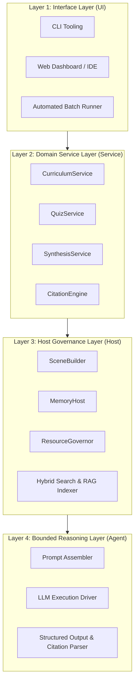
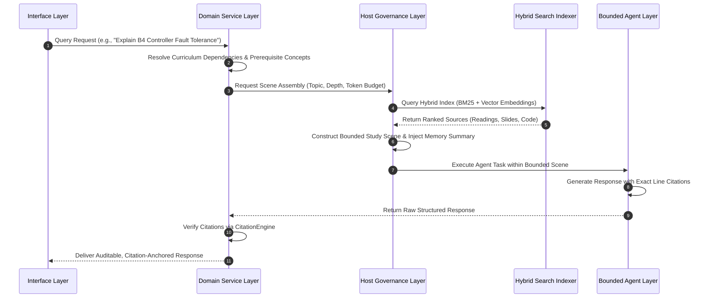
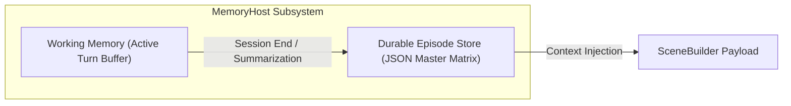
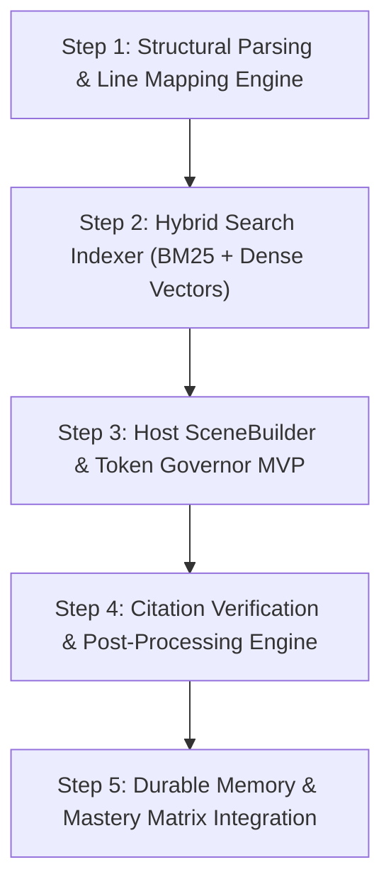

# Autonomous Research & Curriculum Agent: System Architecture and Technical Specification

## 1. System Overview and Engineering Philosophy

This specification defines the architectural design, subsystem boundaries, and data contracts for an autonomous Research and Curriculum Agent system engineered to ingest, index, synthesize, and evaluate computer networking and distributed systems courseware located within the `research/` directory tree.

**Implementation status convention used throughout this document:**

- **Implemented** — working code exists in `tools/research/` and behaves as described.
- **Partially implemented** — code exists but covers only part of the described behavior; the gap is stated inline.
- **Planned (not yet implemented)** — no code exists; the section is retained as a design target.
- **Backburner** — like Planned, but explicitly deprioritized: not on the near-term roadmap; revisit only if the need resurfaces.

Layer 4 (Bounded Reasoning) is currently **deliberately descoped**: the interactive coding agent, driven by `.agents/skills/research-agent/SKILL.md`, plays the role of prompt assembly, LLM execution, and output parsing. **Unblock condition:** Layer 4 stays mapped to the host agent until an unattended or scheduled workflow requires LLM invocation without an interactive session (e.g. nightly batch card drafting, or bulk generation routed to a cheaper model).

### 1.1 Core Engineering Principles

1. **Host-Constrained Execution Governance:** The execution runtime (the Host) strictly governs all resource lifecycles, memory boundaries, context assembly, and file system I/O. The Large Language Model (LLM) operates strictly within bounded context windows prepared by the Host.
2. **Decoupled Four-Layer Architecture:** Complete separation of concerns between Interface (UI), Domain Logic (Service), State & Lifecycle Management (Host), and LLM Interactions (Agent).
3. **Deterministic Scene Assembly:** Rather than performing unconstrained vector searches across thousands of documents, the Host assembles a deterministic, high-density context bundle ("Study Scene") prior to invoking the LLM.
4. **Auditable Citation Anchoring:** Every analytical statement, protocol explanation, and code reference produced by the system must be contractually tied to verified line ranges within repository source files (`.md` sidecars, source code, and configuration manifests).

---

## 2. Four-Layer System Architecture



Component status summary (details inline per section):

| Component                   | Status                 | Code location                                                                                  |
| :-------------------------- | :--------------------- | :--------------------------------------------------------------------------------------------- |
| CLI Tooling                 | Implemented            | `tools/research/*.py` argparse mains                                                           |
| Web Dashboard / IDE         | Backburner             | —                                                                                              |
| Automated Batch Runner      | Implemented            | `tools/research/batch_runner.py`                                                               |
| CurriculumService           | Implemented            | `tools/research/curriculum_service.py`                                                         |
| QuizService                 | Backburner             | —                                                                                              |
| SynthesisService            | Implemented            | `tools/research/synthesis_service.py`                                                          |
| CitationEngine              | Implemented            | `tools/research/citation_engine.py`                                                            |
| SceneBuilder                | Implemented            | `tools/research/scene_builder.py`                                                              |
| MemoryHost                  | Implemented            | `tools/research/memory_host.py`                                                                |
| ResourceGovernor            | Implemented            | `tools/research/resource_governor.py`                                                          |
| Hybrid Search & RAG Indexer | Implemented            | `tools/research/search_chunks.py`, `dense_indexer.py`                                          |
| Prompt Assembler            | Descoped to host agent | —                                                                                              |
| LLM Execution Driver        | Descoped to host agent | —                                                                                              |
| Structured Output Parser    | Partially implemented  | citation extraction in `citation_engine.py`; general JSON-schema parser descoped to host agent |

### 2.1 Layer 1: Interface Layer (UI)

The Interface Layer acts as the entry point for human interaction and automated task scheduling:

- **CLI Tooling — Implemented.** Each Phase 1–5 module ships an argparse CLI: `parse_chunks.py`, `search_chunks.py` (query, `--limit`, `--rrf`, `--json`), `scene_builder.py` (query, `--max-tokens`, `--top-k`), `citation_engine.py`, and `memory_host.py` (`--record --module --topic --score`). The research-agent skill drives them as agent-invoked commands. Scope caveat: this is search/scene/citation/memory tooling only; the "self-assessment" and "diagnostic execution" verbs are not implemented.
- **Web Dashboard / IDE — Backburner.** No graphical interface, Markdown renderer, concept-graph viewer, or document viewer exists anywhere in the repo. Deprioritized: the CLI plus the interactive agent cover current needs.
- **Automated Batch Runner — Implemented.** `tools/research/batch_runner.py` queues and runs existing CLI verbs over a manifest of queries with per-job status capture (single-machine, stdlib-only).

### 2.2 Layer 2: Domain Service Layer (Service)

The Service Layer implements domain-specific logic tailored to academic curriculum analysis:

- **`CurriculumService` — Implemented.** `tools/research/curriculum_service.py` maintains a hand-authored prerequisite graph across the four course directories and exposes a query API for prerequisite chains.
- **`QuizService` — Backburner.** Nothing synthesizes practice problems, problem set solutions, or grading rubrics from historical homeworks, quizzes, and exams. Deprioritized: quiz generation is handled ad hoc by the interactive agent when needed.
- **`SynthesisService` — Implemented.** `tools/research/synthesis_service.py` accepts two queries and emits one token-bounded scene containing chunks from both matching courses; synthesis prose remains with the host agent.
- **`CitationEngine` — Implemented.** `tools/research/citation_engine.py` validates file existence, line-range bounds, and text-content alignment (normalized/fuzzy-whitespace match of the cited label/quote against source lines).

### 2.3 Layer 3: Host Governance Layer (Host)

The Host Layer serves as the deterministic runtime engine, controlling resource boundaries, memory, and information retrieval:

- **`SceneBuilder` — Implemented.** `tools/research/scene_builder.py` assembles token-bounded context payloads ("Study Scenes") from ranked chunks, with distinct primary-reading, prerequisite, and lab-code slots, plus optional durable-memory injection when a memory store is present (see §3.1).
- **`MemoryHost` — Implemented.** `tools/research/memory_host.py` implements the Durable Episode Store (JSON persistence, mastery records, weak/strong reporting), an active-turn Working Memory buffer with explicit flush into the durable store, and a performance-derived mastery-score computation path (see §4).
- **`ResourceGovernor` — Implemented.** `tools/research/resource_governor.py` owns token budgets (used by `SceneBuilder`) and enforces configurable per-command timeouts for the research CLIs; read-only-FS sandboxing is intentionally out of scope.
- **Hybrid Search & RAG Indexer — Implemented.** `tools/research/search_chunks.py` implements a BM25 Okapi lexical index (with heading/path score boosts), and `tools/research/dense_indexer.py` builds a dense embedding index over the chunk manifest. The `--rrf` mode fuses BM25 and vector rankings via reciprocal rank fusion.

### 2.4 Layer 4: Bounded Reasoning Layer (Agent)

**Status: Descoped to the interactive host agent** (see §1). The Agent Layer isolates LLM invocation and structured response parsing; it is not implemented as code in this repo:

- **Prompt Assembler — Descoped to host agent.** No template-rendering component exists; the nearest artifact is the hardcoded prompt/citation-contract text in `SceneBuilder._render_markdown_scene`.
- **LLM Execution Driver — Descoped to host agent.** No inference-API dispatch code, timeout, or token-constrained client exists in `tools/research/`; the interactive agent fulfills this role.
- **Structured Output & Citation Parser — Partially implemented.** Citation extraction exists in `CitationEngine.extract_citations`; there is no general Markdown/JSON-schema output parser (descoped to host agent).

---

## 3. Deterministic Scene Assembly Lifecycle



This diagram is the **target** flow. In the current implementation the actual flow is: CLI query → hybrid BM25+vector search → token-bounded scene assembly (with optional curriculum prerequisite resolution and durable-memory injection) → the interactive agent answers within the scene → optional `CitationEngine` verification. The prompt assembly, LLM execution, and general structured-output parsing remain with the host agent.

### 3.1 Study Scene Composition Formula

A Study Scene $S$ is a deterministic payload constructed by the Host prior to model invocation:

$$S = \{ R_{\text{primary}}, C_{\text{prereq}}, A_{\text{code}}, M_{\text{episode}}, B_{\text{token}} \}$$

Where:

- $R_{\text{primary}}$: Target primary reading source (e.g., paper markdown sidecar). **Implemented**: the top-ranked chunk is labeled as the primary reading.
- $C_{\text{prereq}}$: Contextual prerequisite material (e.g., lecture slide markdown). **Implemented**: non-primary chunks are labeled as prerequisite/context material.
- $A_{\text{code}}$: Associated lab source code or network topology specification (`.p4`, `.py`, `.gns3`). **Implemented**: an explicit code/topology slot is populated when a matching chunk ranks in the candidate set.
- $M_{\text{episode}}$: Condensed durable memory of student progress and previous misconceptions. **Implemented**: `SceneBuilder.build_scene` optionally injects `MemoryHost.render_memory_context` when a memory store is provided.
- $B_{\text{token}}$: Maximum allowable context window budget (e.g., 16,384 tokens). **Implemented** — `build_scene(query, max_tokens=..., top_k=...)` enforces the budget via `ResourceGovernor`, truncating an oversized first chunk.

---

## 4. Memory Architecture and State Management



Both edges are implemented: `MemoryHost` exposes an active-turn Working Memory buffer with an explicit flush/summarize path into the Durable Episode Store, and `SceneBuilder` optionally injects the rendered durable-memory context into scene payloads (see §2.3).

### 4.1 Memory Classification

1. **Working Memory — Implemented.** `tools/research/memory_host.py` provides an in-process active-turn buffer that records turns and an explicit flush path that summarizes them into the Durable Episode Store. It is not a daemon or background writer.
2. **Durable Episode Store — Implemented.** `tools/research/memory_host.py` maintains a persistent JSON database (`research/.durable_memory.json`) tracking concept mastery across sessions. Callers may still supply scores directly (the CLI `--record --score` path), and a computed path derives mastery from the `session_history` performance log.

### 4.2 Durable Mastery Matrix Schema

The implemented Durable Episode Store schema (multi-student, nested under `students`) is:

```json
{
  "metadata": { "created_at": "2026-08-02T02:00:00Z", "version": "1.0.0" },
  "students": {
    "default_user": {
      "modules": {
        "cs231-distributed-systems": {
          "paxos_consensus": { "mastery_score": 0.85, "last_reviewed": "2026-08-01" },
          "vector_clocks": { "mastery_score": 1.0, "last_reviewed": "2026-07-30" }
        },
        "cs234-advanced-networks": {
          "b4_traffic_engineering": { "mastery_score": 0.9, "last_reviewed": "2026-08-02" }
        }
      },
      "session_history": [
        {
          "timestamp": "2026-08-02T02:00:00Z",
          "module": "cs234-advanced-networks",
          "topic": "b4_traffic_engineering",
          "score": 0.9
        }
      ]
    }
  }
}
```

This deviates from the original single-student design (top-level `student_id` / `modules`): the implementation nests records under `students{}` and adds the `session_history` append log. `get_student_report` aggregates stored scores (average, weak < 0.70, strong ≥ 0.85); a **Mastery Matrix updating engine** calculates proficiency from the `session_history` performance log in addition to the caller-supplied-score path.

---

## 5. Citation Contract and Line-Anchored Verification

### 5.1 Citation Format Standard

All agent output referencing source materials must adhere to the explicit file URI format with line ranges:

```markdown
[<relative_path>#L<start_line>-L<end_line>](file://<absolute_path>#L<start_line>-L<end_line>)
```

Example:

```markdown
[cs234-04/part-01.md#L45-L60](file:///Users/lz/dev/networking/research/cs234-advanced-networks/01-slides/cs234-04/part-01.md#L45-L60)
```

`search_chunks.format_file_link` generates exactly this format, and `SceneBuilder` embeds it as the mandatory citation contract in every scene payload. Note that `CitationEngine`'s parser is more permissive than the standard: the `file://` scheme is optional, a single-line `#L<n>` anchor is accepted, and the link label is unconstrained.

### 5.2 Citation Validation Pipeline

Before returning output to Layer 1, the `CitationEngine` verifies:

1. Target file existence on the file system. **Implemented.**
2. Line range validity (ensuring start and end line bounds fall within actual file line counts). **Implemented** (start ≥ 1, end ≥ start, start ≤ total lines; end is capped to the file length).
3. Text content alignment (verifying that quoted text matches source line contents). **Implemented** — `verify_text` compares the citation's label/quote to the referenced source lines using a normalized/fuzzy-whitespace match.

The rejection path is incomplete relative to this design: `verify_text` returns a per-citation report (and the CLI exits non-zero on failures), but there is **no auto-retry loop** that rejects the response and returns it to Layer 3 for re-parsing or correction — **descoped to the host agent**.

---

## 6. Anki Export Integration

Research-agent answers can be exported as Anki cards. The export uses the
inverted pipeline in `tools/research/anki_generator.py`: code selects chunks,
the LLM authors the cards, and the validator/import path gates ingestion.
See `anki-card-pipeline-spec.md` for the authoritative description,
including current caveats (validator enforcement scope, verifier status).

### 6.1 Batch card workflow

```text
python3 tools/research/anki_generator.py --count 5 --deck "金融"
    ↓  research/anki_candidates.jsonl
LLM authors → research/anki_cards.jsonl
python3 tools/research/anki_card_validator.py research/anki_cards.jsonl
python3 tools/research/anki_generator.py --import --deck "金融"
```

### 6.2 Ad-hoc answer export

For a single synthesized answer, use the `--front` / `--back` path:

```bash
python3 tools/research/anki_generator.py \
  --front "<strong>Concept</strong>: core question?" \
  --back "<div>structured answer</div>" \
  --deck "金融" --tags "research <module>"
```

### 6.3 State discipline

- Never hand-edit `research/.anki_coverage.json`; use CLI verbs only. (Current
  exception in code: `anki_import_verifier.py` rewrites it directly — see the
  pipeline spec §2/§4.)
- Reject bad candidates with `--reject-chunk <id> --reason <category>` instead
  of writing low-quality cards.
- Verify imports with `python3 tools/research/anki_import_verifier.py`. Note
  this verifier is **currently a no-op in practice**: it only checks chunks in
  `pending_import` status, which production `--import` never sets (it writes
  `imported` directly).

---

## 7. Quality Assurance and CI Integration

The system architecture integrates directly into existing repository quality gates:

1. **Pre-commit Gating (`make precommit`):** Ensures that all added scripts, configuration files, and documentation pass formatting (Prettier), linting (ESLint; Python complexity via xenon), and coverage floors (Jest, pytest). The JS type check (`make type`) is non-blocking.
2. **Deterministic Test Suites:** Unit tests in `__tests__/` validate `SceneBuilder` context construction, `CitationEngine` URL verification, `MemoryHost` serialization, and the Anki pipeline. An end-to-end test (`test_research_agent_e2e.py`) exercises parse → BM25 search → scene assembly → citation verification → mastery recording → the full Anki pipeline with a mocked LLM/AnkiConnect.

---

## 8. Implementation Roadmap and Phased Rollout



### 8.1 Phase 1: Structural Parsing & Line Mapping Engine — Implemented

- **Objective:** Ingest `.md` sidecars, slides, and source code while establishing accurate line-number offset maps.
- **Key Deliverables:**
  - Heading-aware parser splitting text at Markdown header boundaries (`#`, `##`) and slide separators (`<!-- slide -->`). **Implemented** in `tools/research/parse_chunks.py` (headers `#{1,6}`).
  - Line-offset mapping data structure linking every text segment to its start line and end line in the source file. **Implemented** (`start_line`/`end_line` per chunk in `research/.chunks_manifest.json`).
  - Code block integrity handler preserving P4, Python, C, and GNS3 topology configs without mid-block truncation. **Implemented** — fenced code blocks suppress header/slide splits, and whole source files are emitted as single intact chunks. (Caveat: `SceneBuilder` may still truncate chunk content at display time to fit the token budget.)

### 8.2 Phase 2: Hybrid Search Indexer Construction — Implemented

- **Objective:** Build dual lexical and vector search indices over parsed structural chunks.
- **Key Deliverables:**
  - BM25 Lexical Index targeting exact technical terms, protocol RFC numbers, packet fields, and function symbols. **Implemented** (`BM25Indexer` in `search_chunks.py`, with heading/path boosts).
  - Dense Vector Embedding Index representing semantic conceptual similarity across course modules. **Implemented** (`DenseIndexer` in `dense_indexer.py`).
  - Reciprocal Rank Fusion (RRF) ranker combining lexical and semantic scores into a unified top-K result set. **Implemented** — `--rrf` fuses BM25 and vector rankings via `reciprocal_rank_fusion`.

### 8.3 Phase 3: Host SceneBuilder & Token Governor MVP — Implemented

- **Objective:** Construct the Host-side context assembly pipeline.
- **Key Deliverables:**
  - `SceneBuilder` context bundler assembling primary readings, prerequisite slide excerpts, and lab code. **Implemented** — source-type slots, memory injection, and token budgeting are all present (§3.1).
  - `ResourceGovernor` token tracking ensuring compiled scenes remain within model context window limits. **Implemented** — `tools/research/resource_governor.py` owns budgets and timeouts; read-only FS enforcement is intentionally out of scope.

### 8.4 Phase 4: Citation Verification & Post-Processing Engine — Implemented (auto-retry descoped)

- **Objective:** Enforce auditable line-anchored citations on all generated outputs.
- **Key Deliverables:**
  - `CitationEngine` URL validator checking file existence, line bounds, and snippet matching. **Implemented** — all three checks run (§5.2).
  - Auto-retry loop rejecting unverified or hallucinated file references before delivery to Layer 1. **Descoped to host agent**.

### 8.5 Phase 5: Durable Memory & Mastery Matrix Integration — Implemented

- **Objective:** Persist student progress and mastery state across evaluation sessions.
- **Key Deliverables:**
  - Working Memory buffer and Durable Episode Store JSON serializer. **Implemented** — active-turn buffer with explicit flush plus durable store (§4.1).
  - Mastery Matrix updating engine calculating topic proficiency scores based on student performance. **Implemented** — `record_mastery` supports both caller-supplied scores and computed scores derived from `session_history`.
