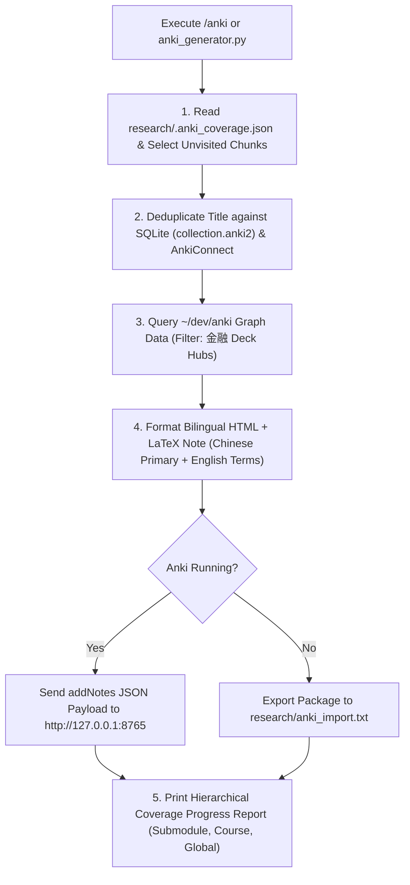

# User Manual: Autonomous Agent Skills (`research-agent` & `anki`)

This manual provides complete step-by-step instructions, operational workflows, and CLI commands for utilizing the two primary research and learning skills in this repository: **`research-agent`** and **`anki`**.

---

## 1. Executive Summary & Quick Reference

| Skill                | Primary Purpose                                                                                                                                    | Trigger / Command                                                         | Core Tools & Deliverables                                                      |
| :------------------- | :------------------------------------------------------------------------------------------------------------------------------------------------- | :------------------------------------------------------------------------ | :----------------------------------------------------------------------------- |
| **`research-agent`** | Search, parse, assemble token-bounded context, and verify line-anchored citations over `research/` courseware (`cs231`..`cs234`).                  | Slash command: `/research-agent` or prompt: `@research-agent <topic>`     | `search_chunks.py`, `scene_builder.py`, `citation_engine.py`, `memory_host.py` |
| **`anki`**           | Select unvisited courseware chunks, deduplicate, link to PageRank hubs in `金融` deck, render bilingual HTML cards, and ingest directly into Anki. | Slash command: `/anki` or CLI: `python3 tools/research/anki_generator.py` | `anki_generator.py`, `AnkiGraphBridge`, AnkiConnect REST API, TSV packages     |

---

## 2. Skill 1: `research-agent` Manual

The `research-agent` skill allows you to query, analyze, and synthesize technical concepts across all courseware in `research/` (`cs231` Distributed Systems, `cs232` Computer Architecture, `cs233` Operating Systems / Networking, `cs234` Advanced Networking / B4 / Paxos).

### 2.1 How to Invoke `research-agent`

#### Method A: Interactive Chat / Slash Command

Type the skill command or tag the skill in your chat prompt:

```text
/research-agent Explain how B4 traffic engineering handles link failures in Clos topologies
```

#### Method B: Direct Command-Line Tooling

##### 1. BM25 Lexical Chunk Search

Search for relevant slide sections, paper excerpts, or code blocks matching a query:

```bash
python3 tools/research/search_chunks.py "B4 WAN traffic engineering" --limit 5
```

##### 2. Assemble Token-Bounded Study Scene

Compile a token-bounded context bundle with mandatory line-anchored Markdown citations (`[path#Lstart-Lend](file://...)`):

```bash
python3 tools/research/scene_builder.py "Paxos consensus failure modes" --max-tokens 8192
```

##### 3. Verify Markdown Citations

Validate that line-anchored citations embedded in a generated answer point to valid repository line ranges:

```bash
python3 tools/research/citation_engine.py "research/cs231-distributed-systems/00-materials/paxos.md"
```

##### 4. Track Student Mastery Matrix

View or update durable topic mastery scores for a student profile:

```bash
# View student progress report:
python3 tools/research/memory_host.py --student "default_user"

# Record a topic mastery score:
python3 tools/research/memory_host.py --student "default_user" --record --module "cs234" --topic "b4_traffic_engineering" --score 0.95
```

##### 5. Re-index Courseware Chunks

If you add or edit Markdown files in `research/`, update the search index:

```bash
python3 tools/research/parse_chunks.py
```

### 2.2 Citation Formatting Rules

All responses generated using `research-agent` MUST adhere to line-anchored Markdown citations:

```markdown
According to the Berkeley NOW architecture [[berkely-now.md#L93-L172](file:///Users/lz/dev/networking/research/cs231-distributed-systems/00-materials/berkely-now.md#L93-L172)], switch interconnects form fat-tree topologies...
```

---

## 3. Skill 2: `anki` Manual

The `anki` skill automates the creation of high-density flashcards from unvisited `research/` courseware, enforcing quality gates, deduplication, knowledge graph linking, bilingual formatting, and multi-channel ingestion into Anki.



### 3.1 How to Invoke `anki`

#### Method A: Interactive Chat Command

Run the `/anki` slash command in chat:

```text
/anki
```

#### Method B: One-Liner Terminal Execution

##### Standard Ingestion (5 Cards into `金融` Deck)

Generates 5 high-density cards from unvisited courseware and ingests them into Anki:

```bash
python3 tools/research/anki_generator.py --count 5 --deck "金融"
```

##### Auto-Launch Anki GUI if Closed

If Anki is not running, automatically launches `/Applications/Anki.app` before ingesting:

```bash
python3 tools/research/anki_generator.py --count 5 --deck "金融" --auto-launch
```

##### Check Memorization & Progress Bars Only

Displays current memorization percentages without generating new cards:

```bash
python3 tools/research/anki_generator.py --status
```

##### Export TSV Package Only (Offline Mode)

Generates formatted tab-separated package file (`research/anki_import.txt`) for manual GUI import:

```bash
python3 tools/research/anki_generator.py --count 5 --deck "金融" --export-tsv
```

---

## 4. Understanding Card Quality, Design & Knowledge Graph Rules

### 4.1 Bilingual Translation Standard

- **Primary Language:** Card body is written primarily in Simplified Chinese (简体中文).
- **Technical Annotations:** All technical terms, protocol names, and hardware modules MUST include their original English names or acronyms.
- **Example:** `网络地址转换 (Network Address Translation, NAT)`, `共识协议 (Consensus Protocol)`.

### 4.2 Note Fields Structure

- **Front Field (Field 0):** Concise concept title or tradeoff with bolding or LaTeX math notation (`\(...\)`).
- **Back Field (Field 1):** Structured HTML containing:
  - **背景 / 痛点 (Motivation & Pain Points)**
  - **核心机制 & 流程 (Core Mechanism & Flow)**
  - **相关关联概念 (Related Graph Concepts):** Auto-injected high-PageRank hub concepts from the `金融` deck graph.
  - **源码 & 文档引用 (Citations):** Line-anchored file links (`[path#Lstart-Lend](file://...)`).

### 4.3 `金融` Deck Knowledge Graph Scoping

When querying PageRank hub notes or cross-references from `~/dev/anki/graph/graph_data.json`:

- **Target Deck Scope:** Scoped **exclusively to the `金融` deck**.
- **Excluded Decks:** All language-learning decks (`言語日語`, `言語粤語`, `言語英語`, `言語呉語`, `言語台語`) are automatically filtered out.

---

## 5. Hierarchical Coverage Progress Bar Output

At the conclusion of an `/anki` generation run, the terminal outputs a 3-level progress report:

```text
================================================================================
📊 Anki Courseware Memorization Progress Report
================================================================================
  Submodule : cs231-distributed-systems/00-materials
              [██████████████████████░░░░░░░░░░░░░░░░░░░░]  52.4% (22/42 chunks)

  Course    : cs231-distributed-systems
              [████████████████░░░░░░░░░░░░░░░░░░░░░░░░░░]  38.1% (120/315 chunks)

  Global    : research/ (cs231, cs232, cs233, cs234)
              [████████░░░░░░░░░░░░░░░░░░░░░░░░░░░░░░░░░░]  18.5% (450/2430 chunks)
================================================================================
```

---

## 6. End-to-End Recommended User Workflow

To combine both skills into a powerful study routine:

1. **Step 1 — Deep Topic Research (`research-agent`):**

   ```text
   /research-agent What are the core tradeoffs between Paxos and Multi-Paxos in WAN topologies?
   ```

2. **Step 2 — Review & Understand Context:**
   Read the citation-anchored analysis generated from `research/cs231-distributed-systems/`.

3. **Step 3 — Convert to Durable Memory (`anki`):**

   ```bash
   python3 tools/research/anki_generator.py --count 5 --deck "金融" --auto-launch
   ```

4. **Step 4 — Review Progress:**
   Check the multi-level progress report to monitor your courseware coverage.

---

## 7. Troubleshooting & FAQs

### Q1: AnkiConnect error `urllib.error.URLError: <urlopen error [Errno 61] Connection refused>`

- **Cause:** Anki GUI is closed or AnkiConnect add-on is disabled.
- **Solution:** Pass `--auto-launch` to automatically start `/Applications/Anki.app`, or ensure Anki is open with AnkiConnect configured on port `8765`. Alternatively, use `--export-tsv` to generate `research/anki_import.txt`.

### Q2: Why are language decks in `~/dev/anki` ignored?

- **Cause:** `~/dev/anki` contains language decks (`言語日語`, etc.) alongside domain decks.
- **Solution:** `AnkiGraphBridge` explicitly filters `deck == "金融"` to ensure flashcards focus strictly on CS engineering and financial infrastructure concepts.

### Q3: How do I force re-generating cards for a file?

- **Solution:** Delete or edit the entries in `research/.anki_coverage.json`, or delete `research/.anki_coverage.json` to reset coverage tracking.
